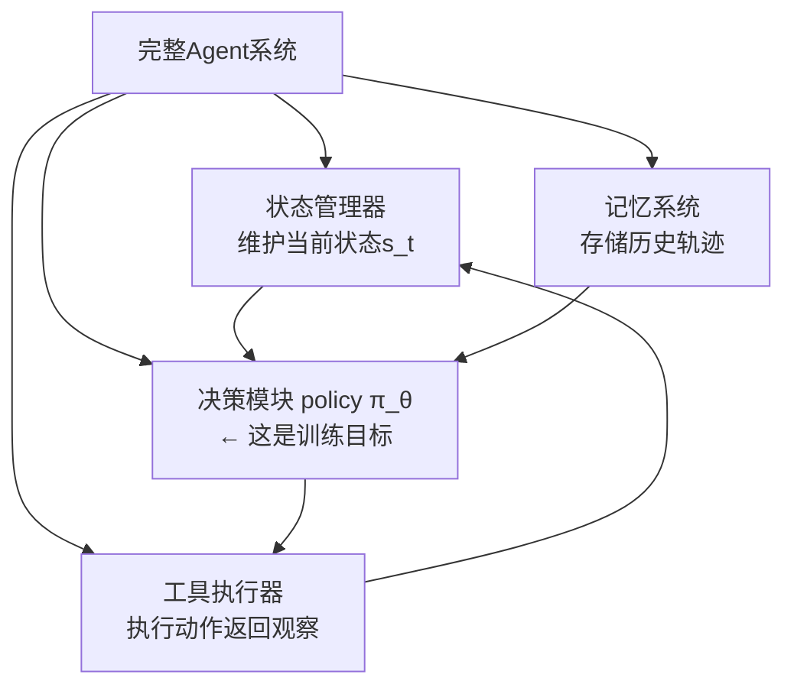
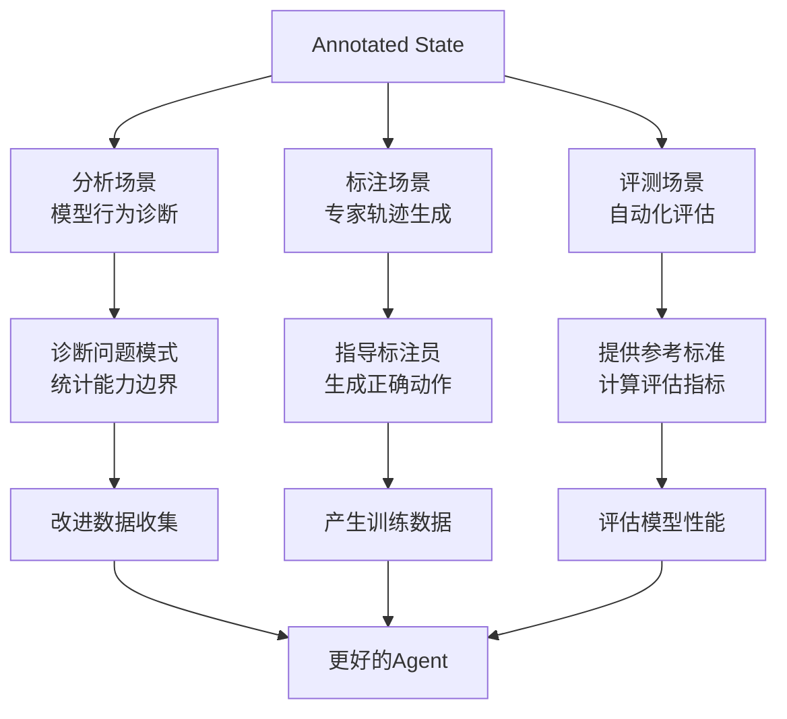
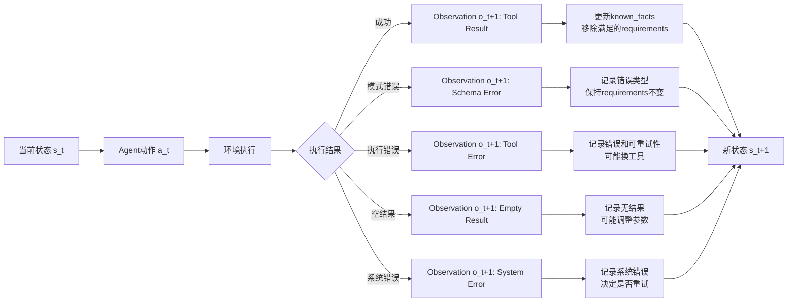
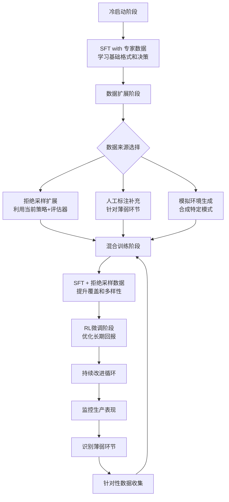
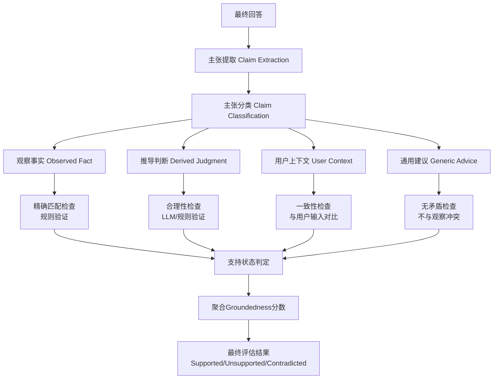

# Agent 训练问题形式化 - 重构版

> **文档重构说明**：本文档基于原始`problem_formulation.md`进行结构重组，旨在改善逻辑清晰度、增强内容衔接、添加辅助图表，同时保持所有技术细节和专业深度完整。所有技术内容均来自原文档，仅进行组织优化。

## 📋 执行摘要

本文档系统地形式化了**工具使用型Agent（Tool-using Agent）的训练问题**，为算法工程师提供了一个完整的建模、数据、训练和评估框架。核心目标是：将"教会AI使用工具完成任务"这一工程问题，转化为可落地实现的数据规范、训练目标和评估体系。

### 🔑 核心洞察

1. **Agent ≠ 模型**：完整的Agent是一个工程系统，我们训练的是其中的**决策模块（policy）**
2. **外部化的思维链**：Agent训练本质上是将CoT的内部推理过程外部化为可执行的动作序列
3. **轨迹为中心**：训练需要专家轨迹数据，展示在每种状态下应该采取的正确动作
4. **状态转移建模**：环境如何根据当前状态、Agent动作和工具观察更新到下一状态，是建模的关键

### 🎯 解决的核心问题


| 问题维度     | 核心解答                                                          |
| ------------ | ----------------------------------------------------------------- |
| **数据表示** | 如何表示一条Agent训练样本？→ (状态, 专家动作) 配对               |
| **模型输入** | 模型每一步看到什么？→ Runtime State（消息历史 + 可用工具）       |
| **模型输出** | 模型预测什么？→ Action（工具调用/最终回答/反问用户）             |
| **状态转移** | 工具结果如何改变状态？→ Transition(s_t, a_t, o_{t+1}) → s_{t+1} |
| **训练目标** | 优化什么？→ 最大化任务成功率：max_θ E[Evaluator(τ_θ, task)]   |
| **评估方法** | 如何判断质量？→ 分层评估：过程合规性 + 语义合理性 + 任务完成度   |

### 🏗️ 文档结构导航

本文档按以下逻辑结构组织，每部分都包含深入的技术细节和实现规范：

```
第一部分：基础概念与核心定义
├── 1.1 核心概念澄清：Agent系统架构分解
├── 1.2 训练目标形式化：从问题到数学模型
├── 1.3 与思维链的对比：外部化推理的关键转变
└── 1.4 核心对象定义：Task/Tool/State/Action/Observation的精确规范

第二部分：系统建模与状态机
├── 2.1 状态表示分层：Runtime State vs Annotated State
├── 2.2 动作空间设计：Tool Call / Final Answer / Ask User
├── 2.3 观察空间建模：工具结果与错误处理
├── 2.4 状态转移规则：完整的Transition决策表
└── 2.5 多工具依赖建模：DAG表示与参数绑定

第三部分：数据、训练与评估
├── 3.1 数据构造方法论：四种来源与质量验收
├── 3.2 训练目标设计：SFT/Rejection Sampling/RL的数学形式
├── 3.3 评估器架构：Step-level与Trajectory-level评估
├── 3.4 失败类型学：完整的Failure Taxonomy与诊断规则
└── 3.5 Groundedness评估：最终回答的基于性验证

第四部分：实现规范与参考
├── 4.1 Canonical Schemas：所有数据结构的JSON Schema
├── 4.2 任务类型划分：七类任务的设计规范
├── 4.3 最小可执行版本：第一阶段实施指南
├── 4.4 建模覆盖矩阵：完整性检查清单
└── 4.5 术语表与交叉引用
```

### 🚀 快速入门路径

**如果您是第一次阅读此文档**，建议按以下顺序：

1. 阅读**1.1-1.2节**理解核心概念
2. 查看**4.3节**了解最小可执行版本
3. 浏览**4.1节**熟悉数据结构规范
4. 根据具体需求深入相关章节

---

## 第一部分：基础概念与核心定义

### 1.1 核心概念澄清：Agent系统架构分解

在深入技术细节之前，必须明确一个关键区分：**完整的Agent是一个工程系统**，而我们要训练的是这个系统中的**决策模块（policy）**。



**关键理解**：

- **系统层面**：Agent = 状态管理 + 工具执行 + 记忆 + 决策
- **训练层面**：我们只训练决策模块π_θ，其他组件是环境的一部分
- **接口层面**：π_θ接收状态s_t，输出动作a_t，不直接感知环境复杂性

#### 1.1.1 决策模块的形式化定义

决策模块学习从当前状态到下一步动作的映射：

$$
\pi_\theta: s_t \to a_t
$$

其中：

- $s_t$：第$t$步时模型的**输入状态**（模型推理时真实可见的信息）
- $a_t$：第$t$步时模型的**输出动作**（如调用工具、给出最终答案、反问用户）

这个映射的本质是**教模型如何像专家一样分步思考和执行**，类似于思维链（CoT），但将内部思考过程外部化为可执行的动作序列。

#### 1.1.2 为什么需要轨迹数据？

决策模块的训练需要**轨迹（trajectory）数据**，原因如下：

1. **学习状态→动作的映射**：需要知道在每个特定状态下应该采取什么动作
2. **学习多步决策逻辑**：需要看到专家如何一步步推进任务完成
3. **学习从错误中恢复**：需要看到专家如何处理工具失败、参数错误等情况

一条轨迹$\tau$记录了完整任务执行过程：

$$
\tau = (s_0, a_0, o_1, s_1, a_1, o_2, \ldots, s_n, a_n)
$$

其中：

- $s_t$：模型第$t$步看到的**输入状态**（由系统生成）
- $a_t$：模型第$t$步输出的**动作**（决策模块的输出）
- $o_{t+1}$：动作执行后环境返回的**观察**（工具结果、错误信息等）
- $s_{t+1}$：系统根据$(s_t, a_t, o_{t+1})$生成的**新状态**

### 1.2 训练目标形式化：从问题到数学模型

给定以下组件：

- 任务分布$D_{\text{task}}$：各种用户任务的集合
- 工具集合$T$：可用的工具及其schema
- 执行环境$\text{Env}$：生成观察$o_{t+1}$和执行状态转移$s_t \rightarrow s_{t+1}$的系统
- 决策模块$\pi_\theta$：要训练的参数化函数
- 评测器$\text{Evaluator}$：判断轨迹是否成功的函数

**训练目标是学习一个决策函数**：

$$
\maximize_{\theta} \ \mathbb{E}_{\text{task} \sim D_{\text{task}}}[\text{Evaluator}(\tau_\theta, \text{task})]
$$

其中$\tau_\theta$是通过策略$\pi_\theta$与环境交互生成的轨迹，$\text{task}$是任务规范。

#### 1.2.1 训练目标的深度解读

这个目标函数包含多个层次的含义：

1. **优化变量是θ**：我们优化的是策略参数，不是轨迹本身
2. **期望在任务分布上**：要求策略在多种任务上表现良好，不是过拟合到特定任务
3. **评估器是任务相关的**：Evaluator需要知道任务规范才能判断成功与否
4. **轨迹是策略依赖的**：$\tau_\theta$强调轨迹是由当前策略生成的

#### 1.2.2 与监督学习的对比

```mermaid
graph LR
    A[传统监督学习] --> B[输入X → 输出Y<br/>单步预测]
    C[Agent训练] --> D[状态s_t → 动作a_t<br/>多步序列决策]
  
    B --> E[损失函数: L(Y_pred, Y_true)]
    D --> F[评估函数: Evaluator(τ, task)]
  
    E --> G[直接误差最小化]
    F --> H[间接成功率最大化]
```

关键区别：

- **数据单位**：监督学习是单样本，Agent训练是完整轨迹
- **损失信号**：监督学习是直接误差，Agent训练是任务成功率
- **时间维度**：监督学习无状态，Agent训练有状态转移

### 1.3 与思维链的对比：外部化推理的关键转变

理解Agent训练与思维链（CoT）训练的关系，有助于把握其核心思想：


| 维度         | 思维链（CoT）训练             | Agent训练                           | 本质区别                 |
| ------------ | ----------------------------- | ----------------------------------- | ------------------------ |
| **训练目标** | 学习在内部如何分步推理        | 学习在外部如何分步执行              | **内部 vs 外部**         |
| **训练数据** | (问题, 推理步骤, 答案) 三元组 | (状态, 动作, 观察, 新状态) 轨迹序列 | **文本 vs 执行**         |
| **模型输出** | 最终答案（可能附带推理文本）  | 下一步动作（工具调用、最终回答等）  | **结果 vs 动作**         |
| **执行方式** | 推理在模型内部完成，不可观察  | 动作在外部世界执行，可验证可干预    | **黑盒 vs 白盒**         |
| **状态管理** | 隐含在模型的内部激活中        | 显式表示为$s_t$，由系统维护         | **隐式 vs 显式**         |
| **泛化能力** | 学会相似问题的推理模式        | 学会相似状态下的决策模式            | **问题相似 vs 状态相似** |

#### 1.3.1 本质联系：外部化的思维链

Agent训练可以看作是 **CoT的外部化和可执行化**：

- **CoT示例**：模型内部默默思考："先查天气 → 温度适中 → 适合跑步" → 输出"适合跑步"
- **Agent示例**：模型将思考变为可执行动作：
  - 状态1（需要信息）→ 动作1（调用天气工具）
  - 状态2（已获取数据）→ 动作2（分析并判断）
  - 状态3（判断完成）→ 动作3（输出最终答案）

这种转变带来了关键优势：

1. **可验证性**：工具调用参数是否正确，可以实际执行验证
2. **可组合性**：可以复用工具、组合多个任务步骤
3. **可恢复性**：工具失败时可以重试、修正参数
4. **可解释性**：每个决策步骤都清晰可见，便于调试分析

#### 1.3.2 训练数据的深层相似性

尽管形式不同，但两者训练数据的本质都是 **"展示专家的思考/决策过程"**：

```python
# CoT 训练样本：展示思考过程
{
  "input": "查北京天气，看是否适合跑步",
  "reasoning": "先查北京天气 → 温度18-25度 → 晴天 → 适合跑步",
  "answer": "适合跑步"
}

# Agent 训练样本：展示执行过程  
{
  "state": "需要查询北京天气",
  "action": "调用天气工具(北京)",
  "next_state": "已获取天气数据(晴,18-25度)",
  "next_action": "判断适合跑步"
}
```

两者都旨在让模型**学会分步解决问题的模式**，只是CoT停留在文本推理层面，而Agent将其升级为可执行的动作序列。

### 1.4 核心对象定义：精确的技术规范

在深入细节之前，我们先明确定义本文档中使用的核心对象。这些定义构成了整个建模框架的基础。

#### 1.4.1 Task（任务）

一个task是用户希望Agent完成的目标，表示为结构化规范：

```json
{
  "task_id": "weather_001", 
  "user_query": "查询明天上海的天气，并告诉我是否适合户外跑步。",
  "available_tools": ["weather"],
  "success_criteria": [
    "调用天气工具查询上海明天天气",
    "根据天气结果判断是否适合户外跑步",
    "最终回答不能编造工具未返回的信息"
  ]
}
```

**关键字段**：

- `task_id`：任务唯一标识
- `user_query`：用户原始输入
- `available_tools`：该任务可使用的工具集合
- `success_criteria`：任务成功条件（必填）

**深度说明**：

- `success_criteria`通常是人工预定义的，为评估提供客观标准
- 在通用agent系统中，如果任务未知，可能需要替代评估策略（如用户反馈、过程合规性评估）
- `available_tools`定义了动作空间的子集，模型只能使用这些工具

#### 1.4.2 Tool（工具）

一个tool是可以被Agent调用的功能单元，包含完整的接口规范：

```json
{
  "name": "weather",
  "description": "查询指定地点和日期的天气。",
  "schema": {
    "type": "object",
    "properties": {
      "location": {"type": "string"},
      "date": {"type": "string"}
    },
    "required": ["location", "date"]
  }
}
```

**关键字段**：

- `name`：工具名称，也是action中的`tool_name`
- `description`：工具用途说明
- `schema`：参数结构、类型和必填字段

**深度说明**：

- 工具schema定义了动作空间的语法约束
- 模型不仅要知道可以调用哪个工具，还要生成符合schema的参数
- 在训练和评测中，工具schema是action space的一部分

#### 1.4.3 State（状态）

State是模型在第`t`步做决策时可见的全部信息，需要区分两种表示：

**Runtime State（运行时状态）**：模型真实推理时能看到的状态

```json
{
  "messages": [
    {"role": "user", "content": "查询明天上海的天气..."},
    {"role": "assistant", "tool_call": {"name": "weather", "arguments": {...}}},
    {"role": "tool", "name": "weather", "content": {"temperature": "18-24C"}}
  ],
  "tools": [{"name": "weather", "schema": {}}]
}
```

**Annotated State（标注状态）**：为了分析、标注、评测而额外添加的结构化状态

```json
{
  "progress": {
    "known_facts": ["上海明天天气已查询"],
    "open_requirements": ["判断是否适合跑步"]
  },
  "expected_next_action": {
    "type": "final_answer"
  }
}
```

**关键原则**：

- `model_input_state`只能包含模型真实看到的输入
- `annotation_state`用于标注和evaluator，不应泄漏给模型
- 如果把`expected_next_action`这类强提示直接放进模型输入，模型可能学到的是读取标注，而不是从上下文中推理

#### 1.4.4 Action（动作）

Action是模型在状态$s_t$下输出的下一步行为，当前分为三类：

1. **Tool Action（工具调用）**：

```json
{
  "type": "tool_call",
  "tool_name": "weather",
  "arguments": {"location": "上海", "date": "明天"}
}
```

2. **Final Action（最终回答）**：

```json
{
  "type": "final_answer",
  "content": "明天上海天气适合户外跑步..."
}
```

3. **Ask User Action（反问用户）**：

```json
{
  "type": "ask_user", 
  "content": "你想查询哪个城市的天气？"
}
```

**合法性约束**：

- 当`type=tool_call`时，必须包含`tool_name`和`arguments`
- 当`type=final_answer`时，必须包含`content`
- 当`type=ask_user`时，必须包含`content`，且内容应该针对缺失信息

#### 1.4.5 Observation（观察）

Observation是action被执行后环境返回的信息：

**成功结果**：

```json
{
  "type": "tool_result",
  "tool_name": "weather",
  "status": "success",
  "result": {"temperature": "18-24C", "rain_probability": "20%"}
}
```

**错误结果**：

```json
{
  "type": "schema_error",
  "tool_name": "weather", 
  "status": "failed",
  "error": {
    "code": "MISSING_REQUIRED_FIELD",
    "message": "Missing required field: location",
    "retryable": true
  }
}
```

**标准错误码**：

- `MISSING_REQUIRED_FIELD`：缺少必填参数
- `WRONG_ARGUMENT_TYPE`：参数类型错误
- `EMPTY_RESULT`：查询成功但无结果
- `TIMEOUT`：工具执行超时
- `PERMISSION_DENIED`：无权限

#### 1.4.6 Trajectory（轨迹）

一条完整trajectory是从用户任务开始，到Agent结束回答或失败终止的全过程：

```json
{
  "trajectory_id": "traj_weather_001_gold",
  "task_id": "weather_001",
  "source": "human_annotated",
  "steps": [
    {
      "step_index": 0,
      "model_input_state": {},
      "annotation_state": {},
      "action": {"type": "tool_call", "tool_name": "weather", "arguments": {...}},
      "observation": {"type": "tool_result", "status": "success", "result": {}}
    },
    {
      "step_index": 1,
      "model_input_state": {},
      "annotation_state": {},
      "action": {"type": "final_answer", "content": "..."},
      "observation": null
    }
  ],
  "terminal_state": {"reason": "final_answer", "success": true},
  "labels": {"success": true, "failure_types": []}
}
```

**关键理解**：

- Trajectory是训练和评测的基本单位
- 对于supervised fine-tuning，可以把每个`(state, expert_action)`拆成一个训练样本
- 对于reinforcement learning，可以把整条trajectory的evaluator score作为优化信号

---

## 📍 第一部分总结与过渡

第一部分建立了Agent训练的基础概念框架，明确了：

1. **问题边界**：我们训练的是Agent系统中的决策模块
2. **数学形式**：训练目标是最大化任务分布上的评估得分
3. **核心对象**：Task/Tool/State/Action/Observation/Trajectory的精确定义
4. **关键洞察**：Agent训练是CoT的外部化和可执行化

**接下来进入第二部分**，我们将深入探讨这些对象如何相互作用，构建完整的系统模型。特别关注：

- 状态如何根据动作和观察进行转移
- 多工具任务如何建模依赖关系
- 错误恢复的逻辑如何设计

[跳转到第二部分：系统建模与状态机 →](#第二部分系统建模与状态机)

---

## 第二部分：系统建模与状态机

第一部分定义了Agent训练的核心对象，第二部分将深入探讨这些对象如何相互作用，构建出完整的系统动态。这是理解Agent工作机理的关键，也是实现可训练、可评估系统的理论基础。

### 2.1 状态表示分层：Runtime State vs Annotated State的深度解析

在Agent系统中，状态表示需要满足双重需求：

1. **推理时**：给模型提供足够但不过度的信息
2. **评估时**：提供丰富的结构化信息用于质量判断

为此，我们引入了两种状态表示的分层设计：

#### 2.1.1 Runtime State：模型真实所见

Runtime State是模型在推理步骤$t$时实际接收到的输入，必须严格限制为**推理时可用的信息**：

```json
 {
  "messages": [
    {"role": "system", "content": "You are an agent that can call tools when needed."},
    {"role": "user", "content": "查询明天上海的天气，并告诉我是否适合户外跑步。"},
    {"role": "assistant", "tool_calls": [{"name": "weather", "arguments": {"location": "上海", "date": "明天"}}]},
    {"role": "tool", "name": "weather", "content": {"temperature": "18-24C", "rain_probability": "20%"}}
  ],
  "tools": [
    {
      "name": "weather",
      "description": "查询指定地点和日期的天气。",
      "input_schema": {
        "type": "object",
        "properties": {
          "location": {"type": "string"},
          "date": {"type": "string"}
        },
        "required": ["location", "date"]
      }
    }
  ]
}
```

**Runtime State的核心原则**：

1. **消息历史完整性**：包含完整的user/assistant/tool消息序列
2. **工具schema可访问性**：模型需要知道如何调用可用工具
3. **无信息泄漏**：不包含任何未来信息或评估用的标注信息

#### 2.1.2 Annotated State：分析与评估支持

Annotated State是为了分析、标注、评测而额外添加的结构化状态，**绝不进入模型输入**：

```json
{
  "progress": {
    "current_phase": "information_processing",
    "subgoals_completed": ["weather_query"],
    "subgoals_pending": ["running_judgment"],
    "known_facts": [
      {"fact": "上海明天气温18-24C", "source": "weather_tool", "step": 0},
      {"fact": "上海明天降雨概率20%", "source": "weather_tool", "step": 0}
    ],
    "open_requirements": [
      {"id": "running_advice", "description": "给出是否适合跑步的建议", "priority": "high"}
    ]
  },
  "expected_next_action": {
    "type": "final_answer",
    "content_requirements": [
      "必须引用温度信息",
      "必须明确是否适合跑步",
      "可以给出注意事项"
    ]
  },
  "failure_labels": [],
  "evaluation_context": {
    "task_complexity": "medium",
    "expected_steps": 2,
    "critical_information": ["temperature", "rain_probability"]
  }
}
```

**Annotated State的三大应用场景**：



#### 2.1.3 字段使用边界：防止训练泄漏

为了避免模型学习到"作弊"行为，必须明确字段的使用边界：


| 字段类别               | 可进入模型输入 | 可用于target | 可用于evaluator | 可用于分析 | 说明               |
| ---------------------- | :------------: | :----------: | :-------------: | :--------: | ------------------ |
| `messages`             |       ✅       |      ❌      |       ✅       |     ✅     | 模型真实上下文     |
| `tools`                |       ✅       |      ❌      |       ✅       |     ✅     | 可用工具schema     |
| `model_input_state`    |       ✅       |      ❌      |       ✅       |     ✅     | runtime state容器  |
| `annotation_state`     |       ❌       |      ❌      |       ✅       |     ✅     | 标注和评测辅助信息 |
| `expected_next_action` |       ❌       |      ❌      |       ✅       |     ✅     | 不能泄漏给模型     |
| `expert_action`        |       ❌       |      ✅      |       ✅       |     ✅     | SFT目标            |
| `labels`               |       ❌       |      ❌      |       ✅       |     ✅     | 成功失败标签       |
| `metadata`             |     ❌默认     |      ❌      |       ✅       |     ✅     | 可用于过滤和分桶   |

**关键规则**：任何标注信息（如`expected_next_action`、`open_requirements`）如果直接放入模型输入，模型可能学会读取标注而非真正推理，导致评估时表现虚高、实际部署时表现下降。

### 2.2 动作空间设计：Tool Call / Final Answer / Ask User的完整规范

动作空间定义了Agent可以采取的所有行为类型。精心设计的动作空间需要在表达能力、学习难度和评估可行性之间取得平衡。

#### 2.2.1 三类核心动作的详细规范

**1. Tool Call Action（工具调用）**

```json
{
  "type": "tool_call",
  "tool_name": "weather",
  "arguments": {
    "location": "上海",
    "date": "明天"
  }
}
```

**正确性检查维度**：

- **工具存在性**：`tool_name`是否在`available_tools`中
- **参数完整性**：是否包含所有`required`字段
- **类型符合性**：参数值类型是否符合schema
- **语义合理性**：参数值是否符合用户意图和上下文

**2. Final Answer Action（最终回答）**

```json
{
  "type": "final_answer",
  "content": "明天上海气温18-24C，降雨概率20%，风力较小，整体适合户外跑步。建议出门前再确认实时天气，并避开可能降雨的时段。"
}
```

**正确性检查维度**：

- **时机恰当性**：是否在信息足够时才结束
- **内容完整性**：是否满足用户任务需求
- **基于性**：是否基于已有observation
- **无幻觉**：是否包含observation中不存在的关键事实

**3. Ask User Action（反问用户）**

```json
{
  "type": "ask_user",
  "content": "你想查询哪个城市的天气？"
}
```

**正确性检查维度**：

- **必要性**：是否确实缺少必要信息
- **明确性**：问题是否清晰、针对性强
- **非冗余**：不询问已提供或可从上下文推断的信息

#### 2.2.2 动作合法性判定与非法样例

Action evaluator应先检查action是否可解析，再检查业务正确性：


| Action         | 合法条件                                 | 非法样例                              | Failure Type                            |
| -------------- | ---------------------------------------- | ------------------------------------- | --------------------------------------- |
| `tool_call`    | 包含`tool_name`和`arguments`，且工具存在 | `{"type":"tool_call","arguments":{}}` | `invalid_action`, `missing_argument`    |
| `tool_call`    | `arguments`通过对应tool input schema     | `{"location":123}`                    | `invalid_schema`, `wrong_argument_type` |
| `final_answer` | 包含非空`content`                        | `{"type":"final_answer"}`             | `invalid_action`                        |
| `ask_user`     | 包含非空`content`，且任务允许反问        | `{"type":"ask_user","content":""}`    | `invalid_action`                        |
| any            | `type`在允许集合中                       | `{"type":"search"}`                   | `invalid_action`                        |

#### 2.2.3 动作终止条件与任务流程控制

不同action对trajectory的终止含义不同，这影响了状态机的设计：


| Action         | 默认是否终止 | 说明                                     | 状态机影响             |
| -------------- | :----------: | ---------------------------------------- | ---------------------- |
| `tool_call`    |    ❌ 否    | 进入工具执行，再返回observation          | 继续循环，等待观察结果 |
| `final_answer` |    ✅ 是    | 正常终止，但不等于任务成功               | 终止轨迹，进入评估阶段 |
| `ask_user`     |  🔄 取决于  | 单轮任务中可终止，多轮任务中等待用户补充 | 可能终止或等待用户输入 |
| invalid action |  🔄 取决于  | 可以终止，也可以允许一次格式修复         | 根据容错策略决定       |

**第一阶段建议**：

- `final_answer`总是终止轨迹
- `ask_user`在单轮任务中终止
- invalid action直接终止并标记失败

### 2.3 观察空间建模：工具结果与错误处理的系统化方法

Observation是action被执行后环境返回的信息，它连接了Agent的意图与环境实际状态。系统化的观察空间设计对于错误恢复训练至关重要。

#### 2.3.1 观察类型分类与结构设计

**1. 成功结果（Tool Result）**

```json
{
  "type": "tool_result",
  "tool_name": "weather",
  "status": "success",
  "result": {
    "temperature": "18-24C",
    "rain_probability": "20%",
    "wind": "light",
    "humidity": "65%"
  },
  "timestamp": "2024-06-04T10:30:00Z",
  "execution_time_ms": 120
}
```

**2. 模式错误（Schema Error）**

```json
{
  "type": "schema_error",
  "tool_name": "weather",
  "status": "failed",
  "error": {
    "code": "MISSING_REQUIRED_FIELD",
    "message": "Missing required field: location",
    "retryable": true,
    "missing_fields": ["location"],
    "suggestion": "请提供查询地点"
  }
}
```

**3. 执行错误（Tool Error）**

```json
{
  "type": "tool_error",
  "tool_name": "weather",
  "status": "failed",
  "error": {
    "code": "SERVICE_UNAVAILABLE",
    "message": "天气服务暂时不可用，请稍后重试",
    "retryable": true,
    "suggested_retry_delay_sec": 30,
    "alternative_tools": ["weather_backup"]
  }
}
```

**4. 空结果（Empty Result）**

```json
{
  "type": "empty_result",
  "tool_name": "weather",
  "status": "success",
  "result": {},
  "note": "查询成功但未找到匹配数据，请检查查询参数"
}
```

**5. 系统错误（System Error）**

```json
{
  "type": "system_error",
  "tool_name": "weather",
  "status": "failed",
  "error": {
    "code": "TIMEOUT",
    "message": "工具执行超时（5000ms）",
    "retryable": true,
    "max_retries": 3
  }
}
```

#### 2.3.2 标准错误码体系与恢复指导

系统化的错误码设计有助于模型学习恢复策略：


| Error Code               | Observation Type | Retryable | 模型恢复指导             | 示例场景                         |
| ------------------------ | ---------------- | :-------: | ------------------------ | -------------------------------- |
| `MISSING_REQUIRED_FIELD` | `schema_error`   |   ✅ 是   | 补充缺失字段后重试       | 缺少`location`参数               |
| `WRONG_ARGUMENT_TYPE`    | `schema_error`   |   ✅ 是   | 修正参数类型后重试       | `date`参数应该是字符串而不是数字 |
| `UNKNOWN_TOOL`           | `schema_error`   |   ❌ 否   | 选择其他可用工具         | 工具名称拼写错误                 |
| `INVALID_ARGUMENT_VALUE` | `tool_error`     |   ✅ 是   | 调整参数值后重试         | `date`参数格式不正确             |
| `EMPTY_RESULT`           | `empty_result`   | 🔄 取决于 | 放宽查询条件或解释无结果 | 查询未来30天天气                 |
| `TIMEOUT`                | `system_error`   |   ✅ 是   | 稍后重试或使用备用工具   | 网络延迟                         |
| `PERMISSION_DENIED`      | `system_error`   |   ❌ 否   | 说明限制或请求授权       | 无API访问权限                    |
| `RATE_LIMITED`           | `system_error`   |   ✅ 是   | 等待或降频调用           | API调用频率超限                  |
| `INTERNAL_ERROR`         | `system_error`   |   ✅ 是   | 稍后重试或使用备用方案   | 工具内部异常                     |

#### 2.3.3 观察对状态转移的影响机制

Observation不是被动信息，而是主动改变Agent认知状态的关键：



### 2.4 状态转移规则：完整的Transition决策表与实现规范

状态转移函数是Agent系统的核心动态，定义了环境如何根据当前状态、Agent动作和工具观察更新到下一状态：

$$
s_{t+1} = \text{Transition}(s_t, a_t, o_{t+1})
$$

#### 2.4.1 Transition函数的工程实现框架

在工程实现上，transition需要系统性地更新多个状态组件：

```python
def transition(state: State, action: Action, observation: Observation) -> State:
    """状态转移函数的核心逻辑"""
    new_state = state.copy()
  
    # 1. 更新消息历史
    new_state.messages.append({
        "role": "assistant",
        "content": None,
        "tool_calls": [action] if action.type == "tool_call" else []
    })
  
    if observation:
        new_state.messages.append({
            "role": "tool",
            "tool_call_id": action.id if hasattr(action, 'id') else None,
            "name": action.tool_name if action.type == "tool_call" else None,
            "content": observation
        })
  
    # 2. 更新历史记录
    new_state.history.append({
        "step": len(new_state.history),
        "action": action,
        "observation": observation,
        "timestamp": get_current_time()
    })
  
    # 3. 更新进度状态（Annotation State部分）
    new_state.annotation_state.progress.step += 1
  
    if observation and observation.type == "tool_result" and observation.status == "success":
        # 从成功结果中提取已知事实
        facts = extract_facts_from_result(observation.result)
        new_state.annotation_state.progress.known_facts.extend(facts)
      
        # 更新未完成需求
        new_state.annotation_state.progress.open_requirements = [
            req for req in state.annotation_state.progress.open_requirements
            if not is_requirement_satisfied(req, facts)
        ]
  
    elif observation and observation.status == "failed":
        # 记录错误状态
        new_state.annotation_state.progress.error_state = {
            "type": observation.type,
            "tool_name": observation.tool_name,
            "error_code": observation.error.code,
            "retryable": observation.error.retryable,
            "attempt_count": state.annotation_state.progress.error_state.attempt_count + 1 
                           if state.annotation_state.progress.error_state else 1
        }
  
    # 4. 判断终止条件
    if action.type == "final_answer":
        new_state.terminal_state = {
            "reason": "final_answer",
            "step": len(new_state.history),
            "timestamp": get_current_time()
        }
    elif action.type == "ask_user" and not state.task.allow_multi_turn:
        new_state.terminal_state = {
            "reason": "ask_user",
            "step": len(new_state.history),
            "timestamp": get_current_time()
        }
    elif len(new_state.history) >= state.task.max_steps:
        new_state.terminal_state = {
            "reason": "max_steps_exceeded",
            "step": len(new_state.history),
            "timestamp": get_current_time()
        }
  
    # 5. 记录失败标签（如果适用）
    if should_record_failure(action, observation, state):
        failure_type = classify_failure(action, observation, state)
        new_state.labels.failure_types.append(failure_type)
  
    return new_state
```

#### 2.4.2 完整的Transition决策表

基于action和observation的不同组合，以下是系统性的状态转移规则：


| 当前action     | Observation                | 下一状态更新                                 |    是否终止    | 可能失败标签                                                               | 恢复指导       |
| -------------- | -------------------------- | -------------------------------------------- | :-------------: | -------------------------------------------------------------------------- | -------------- |
| `tool_call`    | `tool_result/success`      | 记录结果，更新known_facts和open_requirements |      ❌ 否      | none                                                                       | 继续决策       |
| `tool_call`    | `schema_error`             | 记录schema error，等待模型修正               |      ❌ 否      | `invalid_schema`, `missing_argument`                                       | 修正参数重试   |
| `tool_call`    | `empty_result`             | 记录空结果，等待重试、改参或解释无结果       |      ❌ 否      | `wrong_argument_value` (如果参数错误导致)                                  | 放宽参数或解释 |
| `tool_call`    | `tool_error/retryable`     | 记录错误，允许重试或替代工具                 |      ❌ 否      | depends on cause                                                           | 重试或换工具   |
| `tool_call`    | `tool_error/non_retryable` | 记录不可恢复错误                             | ✅ 是(如无替代) | `tool_error_unrecoverable`                                                 | 终止或换领域   |
| `final_answer` | null                       | 设置终止状态，交给evaluator判定成功          |      ✅ 是      | `premature_final_answer`, `missing_tool_call`, `hallucinated_final_answer` | 评估阶段处理   |
| `ask_user`     | null                       | 单轮任务中终止，多轮任务中等待用户输入       |    🔄 取决于    | `unnecessary_ask_user`                                                     | 用户响应或终止 |
| invalid action | null/error                 | 记录非法动作                                 |    ✅ 或重试    | `invalid_action`                                                           | 终止或允许修复 |
| any            | max steps reached          | 强制终止                                     |      ✅ 是      | `max_steps_exceeded`                                                       | 系统强制终止   |

#### 2.4.3 关键转移场景的详细分析

**场景1：Tool Call成功后的状态演进**

```
初始状态s_t:
  - open_requirements: ["查询上海明天天气", "判断是否适合跑步"]
  - known_facts: []
  
动作a_t: tool_call(weather, {location: "上海", date: "明天"})
观察o_t+1: tool_result(success, {temperature: "18-24C", rain: "20%"})

转移后状态s_t+1:
  - messages: 追加assistant tool_call和tool result
  - history: 记录成功步骤
  - open_requirements: ["判断是否适合跑步"] (移除了已满足的)
  - known_facts: ["上海明天气温18-24C", "上海明天降雨概率20%"]
  - 不终止，继续决策
```

**场景2：Schema Error后的恢复机会**

```
初始状态s_t:
  - open_requirements: ["查询天气", "给出建议"]
  - error_state: null
  
动作a_t: tool_call(weather, {date: "明天"})  # 缺少location
观察o_t+1: schema_error(MISSING_REQUIRED_FIELD, location)

转移后状态s_t+1:
  - messages: 追加错误信息
  - history: 记录失败尝试
  - open_requirements: 保持不变
  - error_state: {type: "schema_error", missing: ["location"], retryable: true, attempt: 1}
  - failure_types: ["missing_argument"]
  - 不终止，给模型修正机会
```

**场景3：Final Answer的终止处理**

```
初始状态s_t:
  - open_requirements: ["判断是否适合跑步"]
  - known_facts: [天气信息]
  
动作a_t: final_answer("适合跑步")
观察o_t+1: null

转移后状态s_t+1:
  - messages: 追加final answer
  - terminal_state: {reason: "final_answer", step: t, success: 待评估}
  - 终止轨迹，进入评估阶段
  - 评估器检查：是否还有open_requirements? 回答是否基于known_facts?
```

### 2.5 多工具依赖建模：DAG表示、参数绑定与顺序约束

单工具任务相对简单，真正的挑战在于多工具任务。这需要建模工具间的依赖关系、参数传递逻辑和顺序约束。

#### 2.5.1 多工具任务的图表示

多工具任务可以用有向无环图（DAG）表示，其中节点是工具调用，边是依赖关系：

```json
{
  "task_id": "travel_planning_001",
  "task_type": "multi_tool_sequential",
  "user_query": "帮我查明天从上海到北京的航班，并根据北京天气建议是否需要带伞。",
  "available_tools": ["flight_search", "weather"],
  "tool_plan_spec": {
    "dependency_graph": {
      "nodes": [
        {
          "id": "search_flight",
          "tool_name": "flight_search",
          "required": true,
          "description": "查询上海到北京的航班"
        },
        {
          "id": "check_weather",
          "tool_name": "weather", 
          "required": true,
          "description": "查询北京明天天气"
        }
      ],
      "edges": [
        {
          "from": "search_flight",
          "to": "check_weather",
          "type": "context_dependency",
          "description": "需要确定目的地城市后才能查天气"
        }
      ]
    },
    "argument_bindings": [
      {
        "target_node": "check_weather",
        "target_argument": "location",
        "source_node": "search_flight", 
        "source_path": "result.destination_city",
        "transform": "identity",
        "required": true
      }
    ]
  },
  "success_criteria": [
    "must_call_tool:flight_search",
    "must_call_tool:weather",
    "must_answer_umbrella_advice"
  ]
}
```

#### 2.5.2 依赖类型与顺序约束分类

多工具任务中的依赖可以分为几种类型，每种类型对顺序有不同要求：


| 依赖类型       | 说明                             | 顺序要求 | 示例                           | 评估方法                 |
| -------------- | -------------------------------- | -------- | ------------------------------ | ------------------------ |
| **数据依赖**   | 后一个工具参数来自前一个工具结果 | 严格顺序 | 先查订单ID，再查物流           | exact sequence match     |
| **上下文依赖** | 后一个工具使用前一步确定的上下文 | 严格顺序 | 先查航班目的地，再查目的地天气 | exact sequence match     |
| **验证依赖**   | 后一个工具用于验证前一个结果     | 严格顺序 | 查网页后再查数据库确认         | exact sequence match     |
| **资源依赖**   | 需要前一个工具创建资源（如文件） | 严格顺序 | 先创建文件，再写入内容         | exact sequence match     |
| **逻辑依赖**   | 后一步决策依赖前一步结果         | 严格顺序 | 先分析数据，再基于结论做推荐   | exact sequence match     |
| **无依赖并行** | 多个工具互不依赖                 | 无序     | 查询A股票和B股票价格           | set match                |
| **弱依赖**     | 可以交换顺序但可能低效           | 部分有序 | 先查A再查B vs 先查B再查A       | DAG topological validity |

#### 2.5.3 参数绑定与信息流建模

参数绑定定义了信息如何从一个工具的观察流向下一个工具的参数：

```json
{
  "argument_bindings": [
    {
      "target_step": "check_weather",
      "target_argument": "location",
      "source_step": "search_flight",
      "source_path": "result.destination_city",
      "transform": "identity",
      "validation_rules": [
        {"type": "not_null", "message": "目的地城市不能为空"},
        {"type": "is_city", "message": "必须是有效的城市名称"}
      ],
      "fallback_value": "北京",
      "fallback_condition": "source_result_empty"
    },
    {
      "target_step": "check_weather", 
      "target_argument": "date",
      "source_step": "search_flight",
      "source_path": "result.departure_date",
      "transform": "add_days(1)",
      "description": "查航班出发日期的下一天天气"
    }
  ]
}
```

**参数绑定的关键机制**：

1. **提取路径**：使用JSONPath或类似语法从观察中提取值
2. **转换函数**：对提取的值进行必要转换（格式化、计算等）
3. **验证规则**：确保绑定值的有效性
4. **回退机制**：当源信息不可用时提供默认值
5. **错误处理**：绑定失败时的处理策略

#### 2.5.4 多工具评估的复杂性处理

多工具任务的评估比单工具任务复杂得多，需要考虑多个维度：

```json
{
  "evaluation_results": {
    "basic_metrics": {
      "required_tools_covered": true,
      "extra_tools_count": 0,
      "tool_selection_accuracy": 1.0
    },
    "dependency_metrics": {
      "dependency_valid": true,
      "topological_order_correct": true,
      "missing_dependency_edges": 0
    },
    "parameter_metrics": {
      "argument_binding_valid": true,
      "bound_arguments_count": 2,
      "unbound_required_arguments": 0,
      "binding_accuracy": 1.0
    },
    "efficiency_metrics": {
      "parallelizability_score": 0.8,
      "redundant_calls": 0,
      "optimal_step_count": 3,
      "actual_step_count": 3
    },
    "semantic_metrics": {
      "intermediate_result_usage": true,
      "lost_intermediate_results": 0,
      "synthesis_quality": 0.9
    }
  }
}
```

#### 2.5.5 多工具失败类型的专门处理

多工具任务引入了新的失败模式，需要专门的检测和处理：


| Failure Type               | 触发条件                            | 检测方法                                | 修复策略               |
| -------------------------- | ----------------------------------- | --------------------------------------- | ---------------------- |
| `missing_required_tool`    | 缺少必须调用的工具                  | 检查`required_tools`是否全部出现        | 添加缺失的工具调用     |
| `extra_tool_call`          | 调用了任务不需要的工具              | 检查工具是否在`available_tools`中且必要 | 移除多余调用           |
| `dependency_violation`     | 工具调用顺序违反依赖图              | 检查DAG拓扑顺序                         | 调整调用顺序           |
| `invalid_argument_binding` | 后续参数没有正确来自前序observation | 检查参数绑定路径的有效性                | 修正绑定或添加中间步骤 |
| `lost_intermediate_result` | 工具返回了中间结果，但后续没有使用  | 分析信息流，检查关键结果是否被使用      | 添加使用该结果的步骤   |
| `premature_synthesis`      | 在收集完所有必要信息前就进行综合    | 检查综合步骤前的依赖是否全部满足        | 延迟综合步骤           |

---

## 📍 第二部分总结与过渡

第二部分深入探讨了Agent系统的动态建模，建立了完整的状态转移框架：

1. **状态表示分层**：明确了Runtime State和Annotated State的不同角色和使用边界
2. **动作空间设计**：规范了三类核心动作的结构、合法性和终止条件
3. **观察空间建模**：系统化了工具结果和错误处理，提供了恢复指导
4. **状态转移规则**：给出了完整的Transition决策表和实现框架
5. **多工具依赖**：引入了DAG表示、参数绑定和复杂依赖建模

**这些建模元素共同构成了Agent系统的"游戏规则"**，决定了Agent如何与环境交互，如何从错误中恢复，以及如何完成复杂任务。

**接下来进入第三部分**，我们将关注如何基于这个系统模型进行实际的训练和评估。特别关注：

- 如何构造高质量的训练数据
- 不同训练方法（SFT/RL/Rejection Sampling）的数学形式化
- 评估器设计与失败分析
- Groundedness验证的具体方法

[跳转到第三部分：数据、训练与评估 →](#第三部分数据训练与评估)

---

## 第三部分：数据、训练与评估

前两部分建立了Agent系统的理论框架和动态模型，第三部分将关注实践层面：如何获得数据、如何训练模型、如何评估性能。这是将理论转化为实际系统的关键环节。

### 3.1 数据构造方法论：四种来源与质量验收体系

高质量的训练数据是Agent性能的基础。数据构造需要系统性的方法论，涵盖数据来源、质量控制和验收标准。

#### 3.1.1 四种数据来源及其特点

**1. 人工标注专家轨迹（Human Annotated Expert Trajectories）**

```json
{
  "source": "human_annotated",
  "quality_level": "gold",
  "annotation_process": "multi-stage",
  "cost_per_trajectory": "high",
  "typical_volume": "100-1000",
  "best_for": "冷启动、高质量基准、复杂任务"
}
```

**优点**：

- 质量最高，由领域专家创建
- 包含正确的恢复策略和边界情况处理
- 提供可靠的训练信号

**缺点**：

- 成本高昂，扩展性差
- 可能存在标注者偏差
- 难以覆盖所有任务变体

**2. 真实Agent日志（Real Agent Logs）**

```json
{
  "source": "agent_logs", 
  "quality_level": "mixed",
  "annotation_needed": "post_hoc",
  "cost_per_trajectory": "medium",
  "typical_volume": "10K-100K",
  "best_for": "真实分布、边界情况、错误模式分析"
}
```

**优点**：

- 反映真实用户查询分布
- 包含大量边界情况和错误模式
- 规模大，成本相对较低

**缺点**：

- 质量参差不齐，需要清洗
- 成功轨迹比例可能较低
- 需要后处理标注成功/失败标签

**3. 模型自生成轨迹（Model Self-Generated Trajectories）**

```json
{
  "source": "model_generated",
  "quality_level": "variable",
  "filtering_method": "evaluator_based",
  "cost_per_trajectory": "low",
  "typical_volume": "100K-1M",
  "best_for": "数据扩展、任务变体生成、弱监督学习"
}
```

**优点**：

- 扩展性强，可生成大量数据
- 可以覆盖任务空间的多种变体
- 成本低，自动化程度高

**缺点**：

- 依赖评估器质量，可能引入偏差
- 可能缺少真实的错误恢复模式
- 需要高质量的筛选机制

**4. 环境模拟生成（Simulated Environment Generation）**

```json
{
  "source": "simulated",
  "quality_level": "controlled",
  "generation_method": "rule_based",
  "cost_per_trajectory": "very_low",
  "typical_volume": "1M+",
  "best_for": "特定技能训练、合成任务、算法测试"
}
```

**优点**：

- 完全可控，可精确生成特定模式
- 规模极大，成本极低
- 成功条件清晰，评估简单

**缺点**：

- 可能偏离真实分布
- 缺少真实世界的复杂性
- 需要精心设计模拟环境

#### 3.1.2 数据质量验收标准与流程

无论数据来自何种来源，进入训练集前都需要通过严格的质量验收：

```python
class DataQualityValidator:
    def validate_trajectory(self, trajectory: Trajectory) -> ValidationResult:
        """轨迹数据质量验证"""
        result = ValidationResult()
      
        # 1. Schema合规性检查
        if not self.validate_schema(trajectory):
            result.reject(reason="schema_invalid")
            return result
          
        # 2. 工具可执行性检查
        if not self.validate_tool_executability(trajectory):
            result.reject(reason="tool_not_executable")
            return result
          
        # 3. 标签完整性检查
        if not self.validate_labels(trajectory):
            result.reject(reason="labels_incomplete")
            return result
          
        # 4. 信息泄漏检查
        if self.detect_leakage(trajectory):
            result.reject(reason="leakage_detected")
            return result
          
        # 5. 参考一致性检查
        if not self.validate_reference_consistency(trajectory):
            result.reject(reason="reference_inconsistent")
            return result
          
        # 6. 可复现性检查
        if not self.validate_reproducibility(trajectory):
            result.reject(reason="not_reproducible")
            return result
          
        result.accept()
        return result
```

**验收标准详情**：


| 检查项           | 具体标准                                                             | 检查方法        | 失败处理           |
| ---------------- | -------------------------------------------------------------------- | --------------- | ------------------ |
| **Schema合规性** | task/trajectory/action/observation都符合canonical schema             | JSON Schema验证 | 拒绝，需要修复格式 |
| **工具可执行性** | trajectory中的tool action能被mock或真实executor执行                  | 工具模拟执行    | 拒绝或标记为无效   |
| **标签完整性**   | 每条trajectory有success label和failure types                         | 字段存在性检查  | 补充标注或拒绝     |
| **无信息泄漏**   | SFT input中不包含`expected_next_action`、labels或evaluator结果       | 字段内容分析    | 清理字段或拒绝     |
| **参考一致性**   | reference action与success criteria一致                               | 逻辑一致性检查  | 修正参考或拒绝     |
| **可复现性**     | 数据来源、生成方式、工具版本可追踪                                   | 元数据检查      | 补充元数据或拒绝   |
| **平衡覆盖**     | 不同task type、action type、observation type和failure type有基本覆盖 | 分布统计分析    | 调整采样或标记不足 |

#### 3.1.3 数据清洗与后处理流程

原始数据通常需要经过系统的清洗和后处理：

```
原始数据收集
    ↓
Schema验证与标准化
    ↓
工具名称与schema对齐
    ↓  
动作与观察顺序检查
    ↓
信息泄漏字段去除
    ↓
成功/失败标签标注或修正
    ↓
失败类型分类标注
    ↓
拆分训练样本
    ↓
生成数据质量报告
```

**数据质量报告示例**：

```json
{
  "validation_report": {
    "num_trajectories_processed": 1000,
    "num_accepted": 985,
    "num_rejected": 15,
    "acceptance_rate": 0.985,
  
    "rejection_breakdown": {
      "schema_invalid": 4,
      "tool_not_executable": 3,
      "labels_incomplete": 2,
      "leakage_detected": 3,
      "reference_inconsistent": 2,
      "not_reproducible": 1
    },
  
    "coverage_analysis": {
      "task_type_distribution": {
        "no_tool": 98,
        "single_tool": 490,
        "multi_tool": 245,
        "recovery": 98,
        "ask_user": 54
      },
      "action_type_distribution": {
        "tool_call": 789,
        "final_answer": 985,
        "ask_user": 54
      },
      "failure_type_coverage": {
        "covered_types": 22,
        "missing_types": 3,
        "most_common_failures": ["wrong_argument_value", "premature_final_answer"]
      }
    },
  
    "quality_metrics": {
      "avg_trajectory_length": 2.3,
      "success_rate": 0.82,
      "schema_validity_rate": 0.99,
      "label_completeness": 1.0
    }
  }
}
```

#### 3.1.4 从Trajectory到训练样本的转换

一条完整的trajectory可以被拆分成多个step-level的训练样本，这个过程需要精心设计以避免信息泄漏：

**原始轨迹**：

```
τ = (s₀, a₀, o₁, s₁, a₁, o₂, s₂, a₂)
```

**拆分成SFT样本**：

```json
[
  {
    "sample_id": "task_001_step_0",
    "input": {
      "model_input_state": "s₀"  // 只包含runtime state
    },
    "target": {
      "action": "a₀"  // 专家动作
    },
    "metadata": {
      "task_id": "task_001",
      "step": 0,
      "action_type": "tool_call",
      "trajectory_success": true
    }
  },
  {
    "sample_id": "task_001_step_1", 
    "input": {
      "model_input_state": "s₁"  // 包含o₁的结果
    },
    "target": {
      "action": "a₁"
    },
    "metadata": {
      "task_id": "task_001",
      "step": 1,
      "action_type": "final_answer",
      "trajectory_success": true
    }
  }
]
```

**关键转换原则**：

1. **输入只能是runtime state**：确保训练时模型看到的信息与推理时一致
2. **目标只能是专家动作**：学习正确的行为模式
3. **元数据分离存储**：分析用的信息不进入模型输入
4. **失败轨迹特殊处理**：不能直接作为正样本，可能需要修复或用于其他训练目标

### 3.2 训练目标设计：SFT/Rejection Sampling/RL的数学形式化与工程权衡

基于不同的数据可用性和训练阶段，可以采用不同的训练方法。每种方法都有其数学形式和工程考量。

#### 3.2.1 模仿学习 / 监督微调（Imitation Learning / SFT）

**适用场景**：有高质量专家轨迹数据，冷启动阶段

**数学形式**：

$$
\minimize_{\theta} -\log \pi_\theta(a_t^* | s_t)
$$

其中$(s_t, a_t^*)$是从专家轨迹$\tau^*$中提取的状态-动作对。

**训练样本结构**：

```json
{
  "input": {
    "model_input_state": {
      "messages": [...],
      "tools": [...]
    }
  },
  "target": {
    "action": {
      "type": "tool_call",
      "tool_name": "weather",
      "arguments": {"location": "上海", "date": "明天"}
    }
  }
}
```

**SFT变体与优化**：

1. **基础SFT**：直接模仿专家动作
2. **条件SFT**：根据任务类型或难度调整学习目标
3. **加权SFT**：对重要或困难的样本给予更高权重
4. **课程学习SFT**：从简单任务逐渐过渡到复杂任务

**工程考量**：

- **批量构建**：需要高效地从轨迹中提取样本
- **数据平衡**：确保不同action type的均衡
- **泄漏防止**：严格检查输入不包含未来信息
- **评估隔离**：使用独立的验证集评估过拟合

#### 3.2.2 拒绝采样（Rejection Sampling）

**适用场景**：有可靠评估器，需要扩展数据规模

**数学形式**：

$$
\begin{aligned}
&\text{采样 } \tau_1, \tau_2, \ldots, \tau_k \text{ 从 } \pi_\theta \\
&\text{保留 } \tau_i \text{ 如果 } \text{Evaluator}(\tau_i) \geq \text{threshold}
\end{aligned}
$$

**算法流程**：

```python
def rejection_sampling(policy, evaluator, task_pool, num_samples):
    accepted_trajectories = []
  
    while len(accepted_trajectories) < num_samples:
        # 1. 从任务池采样任务
        task = sample_task(task_pool)
      
        # 2. 用当前策略执行任务
        trajectory = policy.rollout(task)
      
        # 3. 评估轨迹质量
        score = evaluator.evaluate(trajectory, task)
      
        # 4. 根据阈值决定是否接受
        if score >= ACCEPTANCE_THRESHOLD:
            accepted_trajectories.append({
                "trajectory": trajectory,
                "score": score,
                "task": task
            })
          
            # 5. 可选：将接受的轨迹加入训练集
            if TRAIN_WITH_ACCEPTED:
                add_to_training_data(trajectory)
  
    return accepted_trajectories
```

**拒绝采样的变体**：

1. **基础拒绝采样**：单一阈值过滤
2. **分层拒绝采样**：不同任务类型使用不同阈值
3. **自适应拒绝采样**：根据当前数据分布动态调整阈值
4. **多样性引导拒绝采样**：优先接受与现有数据不同的样本

**关键参数设计**：

- **接受阈值**：平衡数据质量和数量
- **采样温度**：控制策略的探索程度
- **评估器置信度**：考虑评估器的不确定性
- **多样性权重**：鼓励覆盖不同任务类型

#### 3.2.3 强化学习（Reinforcement Learning）

**适用场景**：有可靠奖励信号，需要优化长期回报

**数学形式**：

$$
\maximize_{\theta} \mathbb{E}_{\tau \sim \pi_\theta}[R(\tau)]
$$

其中$R(\tau)$是轨迹$\tau$的累积奖励。

**奖励设计框架**：

```json
{
  "reward_components": {
    "step_rewards": {
      "tool_selection": {"weight": 0.15, "range": [0, 1]},
      "schema_validity": {"weight": 0.15, "range": [0, 1]},
      "argument_correctness": {"weight": 0.10, "range": [0, 1]},
      "execution_success": {"weight": 0.10, "range": [0, 1]}
    },
    "trajectory_rewards": {
      "task_success": {"weight": 0.30, "range": [0, 1]},
      "groundedness": {"weight": 0.10, "range": [0, 1]},
      "efficiency": {"weight": 0.05, "range": [0, 1]},
      "recovery_quality": {"weight": 0.05, "range": [0, 1]}
    }
  },
  "reward_calculation": {
    "step_reward": "sum(component_i * weight_i)",
    "trajectory_reward": "sum(component_i * weight_i)",
    "total_reward": "average_step_reward * 0.4 + trajectory_reward * 0.6"
  }
}
```

**RL算法选择考虑**：


| 算法     | 适用场景           | 优点                 | 缺点                 |
| -------- | ------------------ | -------------------- | -------------------- |
| **PPO**  | 一般场景，稳定训练 | 稳定，样本效率相对高 | 超参数敏感           |
| **A2C**  | 分布式训练         | 实现相对简单         | 样本效率较低         |
| **TRPO** | 需要严格策略约束   | 理论保证，更新稳定   | 计算复杂             |
| **SAC**  | 连续动作空间       | 样本效率高，稳定     | 对离散动作适应性一般 |
| **DQN**  | 离散动作空间小     | 值函数估计准确       | 不适合大动作空间     |

**RL训练的关键挑战**：

1. **奖励稀疏性**：只有最终成功/失败提供显著信号
2. **信用分配**：将最终奖励分配到具体动作
3. **探索-利用权衡**：在遵循学习策略和尝试新行为间平衡
4. **训练稳定性**：避免策略崩溃或性能震荡
5. **评估器可靠性**：奖励信号的质量直接影响学习效果

#### 3.2.4 训练阶段演进策略

实际系统通常需要多阶段训练策略：



**阶段间过渡条件**：

- **冷启动→扩展**：基础SFT收敛，在验证集上达到稳定性能
- **扩展→RL**：有足够多样性的数据，评估器可靠
- **RL→生产**：在独立测试集上显著优于SFT基线

### 3.3 评估器架构：Step-level与Trajectory-level评估的完整设计

评估器是训练和部署中的关键组件，需要同时满足准确性、可解释性和效率要求。

#### 3.3.1 评估器的分层架构

```python
class AgentEvaluator:
    """分层评估器架构"""
  
    def __init__(self):
        self.step_evaluator = StepEvaluator()
        self.trajectory_evaluator = TrajectoryEvaluator()
        self.groundedness_evaluator = GroundednessEvaluator()
        self.recovery_evaluator = RecoveryEvaluator()
      
    def evaluate(self, trajectory: Trajectory, task: Task) -> EvaluationResult:
        """完整评估流程"""
        result = EvaluationResult()
      
        # 1. Step-level评估
        step_results = []
        for step in trajectory.steps:
            step_eval = self.step_evaluator.evaluate(
                state=step.model_input_state,
                action=step.action,
                observation=step.observation,
                reference_action=task.reference_actions[step.step_index] if task.reference_actions else None
            )
            step_results.append(step_eval)
          
        result.step_results = step_results
      
        # 2. Trajectory-level评估
        trajectory_eval = self.trajectory_evaluator.evaluate(
            trajectory=trajectory,
            task=task,
            step_results=step_results
        )
        result.trajectory_result = trajectory_eval
      
        # 3. Groundedness评估（如果有final answer）
        if has_final_answer(trajectory):
            groundedness_eval = self.groundedness_evaluator.evaluate(
                final_answer=extract_final_answer(trajectory),
                observations=extract_observations(trajectory),
                task=task
            )
            result.groundedness_result = groundedness_eval
          
        # 4. Recovery评估（如果有错误）
        if has_errors(trajectory):
            recovery_eval = self.recovery_evaluator.evaluate(
                trajectory=trajectory,
                task=task
            )
            result.recovery_result = recovery_eval
          
        # 5. 聚合最终分数
        result.aggregated_score = self.aggregate_scores(
            step_results,
            trajectory_eval,
            groundedness_eval if has_final_answer(trajectory) else None,
            recovery_eval if has_errors(trajectory) else None
        )
      
        return result
```

#### 3.3.2 Step-level评估器设计

Step-level评估器关注单步动作的正确性：

**输入**：

- 当前状态$s_t$
- 模型动作$a_t$
- 观察$o_{t+1}$（如果已发生）
- 参考动作$a_t^*$（如果有）

**输出**：

```json
{
  "step_index": 0,
  "score": 0.85,
  "metrics": {
    "tool_selection_correct": true,
    "schema_valid": true,
    "arguments_correct": false,
    "execution_success": true,
    "timing_appropriate": true
  },
  "failure_types": ["wrong_argument_value"],
  "details": {
    "tool_selection": {
      "expected": "weather",
      "actual": "weather",
      "match": true
    },
    "arguments": {
      "expected": {"location": "上海", "date": "明天"},
      "actual": {"location": "上海", "date": "today"},
      "match_type": "partial",
      "mismatched_fields": ["date"]
    }
  }
}
```

**Step score计算公式**：

$$
\text{step\_score} = 0.30 \times \text{tool\_correct} + 0.25 \times \text{schema\_valid} + 0.25 \times \text{arguments\_correct} + 0.20 \times \text{execution\_success}
$$

#### 3.3.3 Trajectory-level评估器设计

Trajectory-level评估器关注完整任务的成功与否：

**输入**：

- 完整轨迹$\tau$
- 任务规范task
- step-level评估结果

**输出**：

```json
{
  "trajectory_id": "traj_001",
  "score": 0.78,
  "task_success": true,
  "metrics": {
    "required_tools_called": true,
    "success_criteria_met": 3,
    "success_criteria_total": 4,
    "step_success_rate": 0.85,
    "execution_success_rate": 1.0,
    "efficiency_score": 0.9,
    "recovery_success_rate": 1.0
  },
  "failure_types": ["incomplete_final_answer"],
  "success_criteria_evaluation": [
    {"criterion": "must_call_tool:weather", "met": true, "evidence": "step_0"},
    {"criterion": "must_use_observation", "met": true, "evidence": "final_answer references temperature"},
    {"criterion": "must_answer_running_advice", "met": true, "evidence": "final_answer includes advice"},
    {"criterion": "must_mention_precautions", "met": false, "evidence": "no mention of rain precautions"}
  ]
}
```

**Trajectory score计算公式**：

$$
\begin{aligned}
\text{trajectory\_score} =&\ 0.60 \times \text{task\_success} \\
                        &+ 0.25 \times \text{average\_step\_score} \\
                        &+ 0.15 \times \text{recovery\_score}
\end{aligned}
$$

其中$\text{task\_success}$是二进制指标，$\text{average\_step\_score}$是步骤得分的平均值，$\text{recovery\_score}$衡量错误恢复的质量。

#### 3.3.4 确定性规则 vs LLM Judge的权衡

评估器的实现需要在规则确定性和语义理解能力之间权衡：


| 评估维度       | 适合规则实现 | 适合LLM Judge | 混合策略          |
| -------------- | :-----------: | :-----------: | ----------------- |
| Schema合法性   |  ✅ 完全适合  |   ❌ 不需要   | 纯规则            |
| 工具选择正确性 | ✅ 如果有参考 |  🔄 部分适合  | 规则为主，LLM补充 |
| 参数精确匹配   |  ✅ 完全适合  |   ❌ 不需要   | 纯规则            |
| 参数语义匹配   |   ❌ 不适合   |  ✅ 完全适合  | LLM为主           |
| 最终回答质量   |   ❌ 不适合   |  ✅ 完全适合  | LLM评估           |
| 回答基于性     |  🔄 部分适合  |  ✅ 完全适合  | 规则+LLM          |
| 任务完成度     |  🔄 部分适合  |  ✅ 完全适合  | 规则+LLM          |

**混合评估器设计示例**：

```python
class HybridEvaluator:
    def evaluate_final_answer(self, final_answer: str, observations: List[Observation], task: Task):
        # 1. 规则检查：格式、长度等基础要求
        rule_checks = self.rule_based_checks(final_answer, observations)
      
        # 2. 提取关键主张（claims）
        claims = self.extract_claims(final_answer)
      
        # 3. 对每个主张进行分类检查
        claim_results = []
        for claim in claims:
            claim_type = self.classify_claim(claim)
          
            if claim_type == "observed_fact":
                # 观察事实：用规则检查精确匹配
                result = self.check_observed_fact(claim, observations)
            elif claim_type == "derived_judgment":
                # 推导判断：用LLM检查合理性
                result = self.llm_check_derived_judgment(claim, observations)
            elif claim_type == "generic_advice":
                # 通用建议：检查是否与观察矛盾
                result = self.check_generic_advice(claim, observations)
            else:
                # 无法分类：用LLM综合判断
                result = self.llm_general_check(claim, observations, task)
              
            claim_results.append(result)
      
        # 4. 聚合结果
        return self.aggregate_claim_results(claim_results, rule_checks)
```

#### 3.3.5 评估报告与可解释性

好的评估器不仅给出分数，还要提供可解释的诊断信息：

**完整评估报告结构**：

```json
{
  "evaluation_summary": {
    "trajectory_id": "traj_model_v1_001",
    "task_id": "weather_advice_001",
    "overall_score": 0.82,
    "task_success": true,
    "primary_failure_type": null,
    "all_failure_types": []
  },
  
  "detailed_breakdown": {
    "step_by_step": [
      {
        "step": 0,
        "action_type": "tool_call",
        "score": 1.0,
        "highlights": ["工具选择正确", "参数完整", "执行成功"]
      },
      {
        "step": 1,
        "action_type": "final_answer",
        "score": 0.64,
        "highlights": ["基于观察结果", "回答相关"],
        "issues": ["未提及降雨注意事项", "建议不够具体"]
      }
    ],
  
    "success_criteria_evaluation": [
      {
        "criterion": "查询上海明天天气",
        "met": true,
        "evidence": "步骤0调用了weather工具，参数正确",
        "confidence": 1.0
      },
      {
        "criterion": "基于天气给出跑步建议",
        "met": true,
        "evidence": "最终回答引用了温度和降雨信息",
        "confidence": 0.9
      },
      {
        "criterion": "提供具体注意事项",
        "met": false,
        "evidence": "未提及降雨时段的注意事项",
        "confidence": 0.8
      }
    ],
  
    "groundedness_analysis": {
      "claims_extracted": 3,
      "supported_claims": 2,
      "unsupported_claims": 1,
      "contradictions": 0,
      "claim_details": [...]
    }
  },
  
  "comparative_analysis": {
    "vs_baseline": {"improvement": "+0.15", "significant": true},
    "vs_human_expert": {"gap": "-0.08", "areas": ["建议具体性"]},
    "trend_over_time": {"last_5_versions": [0.65, 0.70, 0.75, 0.78, 0.82]}
  },
  
  "recommendations": {
    "immediate_fixes": ["增加降雨注意事项"],
    "training_suggestions": ["收集更多包含具体建议的样本"],
    "evaluator_improvements": ["细化建议具体性的评估维度"]
  }
}
```

### 3.4 失败类型学：完整的Failure Taxonomy与诊断规则

系统化的失败分类是诊断Agent问题、指导数据收集和改进训练的关键。失败类型学需要兼顾覆盖度、互斥性和可操作性。

#### 3.4.1 失败分类的三个维度

失败可以从三个互补的维度进行分类：

**1. 抽象层次维度**

```
高层失败（用户感知）
├── 任务未完成
├── 回答不相关  
├── 信息不准确
└── 建议不可行

中层失败（过程问题）
├── 工具使用错误
├── 参数错误
├── 顺序错误
└── 恢复失败

底层失败（技术问题）
├── Schema不合法
├── 格式错误
├── 执行错误
└── 系统错误
```

**2. 责任归属维度**

```
模型责任失败
├── 决策错误（选错工具、时机不对）
├── 参数错误（值不正确、类型错误）
├── 内容错误（幻觉、矛盾）
└── 恢复错误（未正确处理失败）

环境责任失败  
├── 工具不可用
├── 数据缺失
├── 权限不足
└── 系统异常

任务定义失败
├── 需求不明确
├── 工具不匹配
├── 成功条件矛盾
└── 参考轨迹错误
```

**3. 可检测性维度**

```
可规则检测失败（100%准确）
├── Schema不合法
├── 必填字段缺失
├── 工具不存在
└── 执行超时

需参考检测失败（需参考答案）
├── 工具选择错误
├── 参数值错误（精确匹配）
├── 顺序错误
└── 缺失必要步骤

需语义检测失败（需语义理解）
├── 参数值错误（语义匹配）
├── 最终回答质量
├── 回答基于性
└── 建议合理性
```

#### 3.4.2 核心失败类型详细定义

以下是经过整理的完整失败类型，每种类型都有明确的触发条件和检测方法：


| 失败类型                    | 触发条件                                                      | 所需输入                                               | 可规则判断 | 严重程度 | 修复优先级 |
| --------------------------- | ------------------------------------------------------------- | ------------------------------------------------------ | :--------: | :------: | :--------: |
| `invalid_action`            | action无法解析，或`type`不在允许集合中                        | model action                                           |   ✅ 是   |  🔴 高  |     1     |
| `wrong_tool`                | `action.type=tool_call`，但`tool_name != reference.tool_name` | model action, reference action                         |   ✅ 是   |  🔴 高  |     2     |
| `missing_tool_call`         | reference需要tool call，但模型输出`final_answer`或`ask_user`  | model action, reference action                         |   ✅ 是   |  🔴 高  |     3     |
| `unnecessary_tool_call`     | reference不需要工具，但模型输出`tool_call`                    | model action, reference action/task spec               |   ✅ 是   |  🟡 中  |     11     |
| `missing_argument`          | required field缺失                                            | model action, tool input schema                        |   ✅ 是   |  🔴 高  |     5     |
| `wrong_argument_type`       | 参数类型不符合schema                                          | model action, tool input schema                        |   ✅ 是   |  🔴 高  |     6     |
| `invalid_schema`            | 参数无法通过工具input schema                                  | model action, tool input schema                        |   ✅ 是   |  🔴 高  |     4     |
| `wrong_argument_value`      | 参数值与reference不一致，且不满足语义等价                     | model action, reference action                         |  🔄 部分  |  🔴 高  |     7     |
| `unnecessary_ask_user`      | 信息充足时模型仍反问用户                                      | model action, task spec/reference action               |  🔄 部分  |  🟡 中  |     14     |
| `premature_final_answer`    | 仍有未满足需求时输出final answer                              | model action, annotation state/task criteria           |  🔄 部分  |  🔴 高  |     9     |
| `ignored_observation`       | final answer或下一步action没有使用关键observation             | model trajectory, observations                         |  🔄 部分  |  🔴 高  |     10     |
| `looping_tool_call`         | 重复调用同一工具和同一参数，且没有新信息                      | model trajectory                                       |   ✅ 是   |  🟡 中  |     13     |
| `wrong_order`               | 工具调用顺序违反reference或任务依赖                           | model trajectory, reference trajectory/task dependency |  🔄 部分  |  🔴 高  |     8     |
| `missing_required_step`     | 缺少完成任务所需的关键步骤                                    | model trajectory, success criteria                     |  🔄 部分  |  🔴 高  |     -     |
| `poor_recovery`             | 出现可恢复错误后，模型没有修正、重试或换工具                  | model trajectory, observations                         |  🔄 部分  |  🟡/🔴  |     12     |
| `hallucinated_final_answer` | final answer包含observation或reference中不存在的关键事实      | final answer, observations/reference                   |  🔄 部分  |  🔴 高  |     11     |
| `incomplete_final_answer`   | final answer没有覆盖success criteria                          | final answer, task spec                                |  🔄 部分  |  🔴 高  |     -     |
| `contradict_observation`    | final answer与工具observation明显矛盾                         | final answer, observations                             |  🔄 部分  |  🔴 高  |     -     |
| `max_steps_exceeded`        | 超过环境最大步数仍未终止                                      | model trajectory, eval config                          |   ✅ 是   |  🔴 高  |     -     |

#### 3.4.3 失败检测的优先级与冲突解决

同一步可能触发多个failure type，需要定义优先级以避免重复归因：

**优先级规则**（数字越小优先级越高）：

1. `invalid_action` - 动作层面的根本失败
2. `invalid_schema` - Schema层面的根本失败
3. `wrong_tool` - 工具选择错误
4. `missing_tool_call` - 缺失必要工具调用
5. `missing_argument` - 缺失必填参数
6. `wrong_argument_type` - 参数类型错误
7. `wrong_argument_value` - 参数值错误
8. `wrong_order` - 顺序错误
9. `premature_final_answer` - 过早结束
10. `hallucinated_final_answer` - 幻觉内容
11. `ignored_observation` - 忽略关键观察
12. `poor_recovery` - 恢复失败
13. `unnecessary_tool_call` - 多余工具调用
14. `unnecessary_ask_user` - 多余反问

**冲突解决示例**：

```
动作: {"type": "tool_call", "arguments": {"date": "明天"}}  # 缺少location

可能触发的失败:
1. missing_argument (优先级5)
2. invalid_schema (优先级2)

根据优先级，选择invalid_schema作为primary_failure_type，
但保留missing_argument在failure_types列表中。
```

#### 3.4.4 失败诊断与修复指导

对于每种失败类型，提供具体的诊断和修复指导：

```json
{
  "failure_diagnosis": {
    "failure_type": "wrong_argument_value",
    "step": 0,
    "details": {
      "tool_name": "weather",
      "incorrect_argument": "date",
      "incorrect_value": "today",
      "expected_value": "明天",
      "value_source": "user_query",
      "extraction_context": "查询[明天][上海]的天气"
    },
    "root_cause_analysis": [
      "可能原因1: 模型未能正确从用户查询中提取时间信息",
      "可能原因2: 模型混淆了'today'和'明天'的时间表达",
      "可能原因3: 训练数据中缺少类似的时间提取示例"
    ],
    "immediate_fix": "将date参数值改为'明天'",
    "training_implications": [
      "收集更多时间表达式提取的示例",
      "增加时间表达多样性的训练数据",
      "考虑添加时间规范化预处理"
    ],
    "evaluator_improvements": [
      "增加时间表达语义等价的判断逻辑",
      "考虑区域性时间表达差异"
    ]
  }
}
```

### 3.5 Groundedness评估：最终回答的基于性验证方法

Groundedness评估关注最终回答是否基于已有的观察结果，而不是凭空编造。这是评估Agent可信度的关键维度。

#### 3.5.1 Groundedness评估的层次化框架



#### 3.5.2 主张分类与验证方法

**1. 观察事实（Observed Fact）**

```json
{
  "claim": "上海明天气温18-24C",
  "type": "observed_fact",
  "verification_method": "exact_match",
  "required_observation_fields": ["temperature"],
  "allowed_variations": ["18-24度", "18到24摄氏度"],
  "validation_result": {
    "status": "supported",
    "evidence": "observation.weather.result.temperature",
    "match_type": "exact",
    "confidence": 1.0
  }
}
```

**2. 推导判断（Derived Judgment）**

```json
{
  "claim": "明天适合户外跑步",
  "type": "derived_judgment",
  "verification_method": "rule_based + llm_judge",
  "required_observations": ["temperature", "rain_probability", "wind"],
  "derivation_rules": [
    "if rain_probability < 30% and temperature in comfortable_range and wind not strong: suitable = true",
    "comfortable_range: 15-28C for running"
  ],
  "validation_result": {
    "status": "supported",
    "evidence": "temperature=18-24C, rain=20%, wind=light",
    "rule_evaluation": "all conditions met",
    "llm_judgment": "reasonable based on weather conditions",
    "confidence": 0.9
  }
}
```

**3. 用户上下文（User Context）**

```json
{
  "claim": "用户想在上海跑步",
  "type": "user_context", 
  "verification_method": "context_match",
  "source_requirements": ["user_query", "previous_context"],
  "validation_result": {
    "status": "supported",
    "evidence": "user_query contains '上海' and '跑步'",
    "match_type": "direct_reference",
    "confidence": 1.0
  }
}
```

**4. 通用建议（Generic Advice）**

```json
{
  "claim": "出门前再确认实时天气",
  "type": "generic_advice",
  "verification_method": "contradiction_check",
  "validation_criteria": [
    "not contradict observations",
    "not introduce new specific facts",
    "be generally reasonable"
  ],
  "validation_result": {
    "status": "supported",
    "reason": "generic advice that doesn't contradict observations",
    "confidence": 0.8
  }
}
```

#### 3.5.3 Groundedness评估的实现策略

**第一阶段：规则优先实现**

```python
class RuleBasedGroundednessEvaluator:
    def evaluate(self, final_answer: str, observations: List[Observation]) -> GroundednessResult:
        result = GroundednessResult()
      
        # 1. 结构化字段的精确匹配
        structured_matches = self.check_structured_fields(final_answer, observations)
        result.structured_matches = structured_matches
      
        # 2. 枚举值的映射匹配
        enum_matches = self.check_enum_mappings(final_answer, observations)
        result.enum_matches = enum_matches
      
        # 3. 成功条件覆盖检查
        coverage = self.check_success_criteria_coverage(final_answer, observations)
        result.coverage = coverage
      
        # 4. 明显矛盾检查
        contradictions = self.check_contradictions(final_answer, observations)
        result.contradictions = contradictions
      
        # 5. 聚合结果
        result.grounded_in_observation = (
            len(structured_matches.missing) == 0 and
            len(contradictions) == 0 and
            coverage.required_covered >= coverage.required_total * 0.8
        )
      
        return result
```

**第二阶段：LLM增强实现**

```python
class LLMEnhancedGroundednessEvaluator(RuleBasedGroundednessEvaluator):
    def evaluate(self, final_answer: str, observations: List[Observation], task: Task) -> GroundednessResult:
        # 1. 先用规则检查
        rule_result = super().evaluate(final_answer, observations)
      
        # 2. 如果需要，用LLM检查语义匹配
        if rule_result.needs_semantic_check:
            llm_result = self.llm_semantic_check(final_answer, observations, task)
            rule_result.llm_enhancement = llm_result
          
            # 3. 结合规则和LLM结果
            rule_result.grounded_in_observation = (
                rule_result.grounded_in_observation and
                llm_result.overall_supported
            )
      
        return rule_result
```

**LLM Judge提示设计示例**：

```
你是一个严谨的验证助手，需要判断AI助手的最终回答是否基于提供的工具观察结果。

用户任务：{task_description}

工具观察结果：
{formatted_observations}

AI助手的最终回答：
{final_answer}

请逐项检查最终回答中的关键主张，判断每个主张是否：
1. 直接来自观察结果（提供具体证据）
2. 可以从观察结果合理推导（说明推导逻辑）
3. 属于用户提供的上下文信息
4. 是通用的合理建议（不与观察矛盾）
5. 缺乏依据或与观察矛盾

请以JSON格式输出：
{
  "claims_analysis": [
    {
      "claim": "具体主张文本",
      "type": "observed_fact|derived_judgment|user_context|generic_advice",
      "status": "supported|unsupported|contradicted|not_checkable",
      "evidence": "支持或反对的证据",
      "confidence": 0.0-1.0
    }
  ],
  "overgroundedness": {
    "grounded_in_observation": true/false,
    "unsupported_claims_count": number,
    "contradictions_count": number,
    "overall_confidence": 0.0-1.0
  }
}
```

#### 3.5.4 Groundedness评估的实用建议

**第一阶段实施重点**：

1. **结构化字段优先**：先实现数值、日期、地点等结构化字段的精确匹配
2. **枚举值映射**：建立常见枚举值（如天气状况、风力等级）的映射表
3. **明显矛盾检测**：实现基本的矛盾检测规则
4. **成功条件覆盖**：检查最终回答是否覆盖了任务成功条件

**后续增强方向**：

1. **语义等价扩展**：增加同义词、近义词、不同表达方式的匹配
2. **数值范围处理**：处理"适中"、"较高"等模糊表述与具体数值的对应
3. **推导规则库**：建立领域特定的推导规则库
4. **LLM Judge集成**：在规则无法覆盖时使用LLM进行语义判断

**评估结果的使用**：

1. **训练信号**：Groundedness分数可以作为强化学习的奖励组成部分
2. **数据筛选**：低Groundedness的轨迹需要人工检查或修正
3. **能力诊断**：分析哪些类型的unclaimed claims最常见，指导数据收集
4. **版本比较**：比较不同模型版本的Groundedness表现

---

## 📍 第三部分总结与过渡

第三部分深入探讨了Agent训练与评估的实践层面，建立了完整的数据、训练、评估体系：

1. **数据构造方法论**：明确了四种数据来源的特点、质量验收标准和清洗流程
2. **训练目标设计**：形式化了SFT、拒绝采样、RL等训练方法的数学基础和工程权衡
3. **评估器架构**：设计了分层评估系统，平衡规则确定性和语义理解能力
4. **失败类型学**：建立了系统化的失败分类、检测和诊断框架
5. **Groundedness评估**：提供了最终回答基于性验证的具体方法

**这些实践指南将理论框架转化为可实施的工程方案**，为实际系统的开发提供了具体指导。

**接下来进入第四部分**，我们将提供具体的实现规范、参考示例和完整性检查。特别关注：

- 所有数据结构的完整JSON Schema定义
- 任务类型划分与设计规范
- 最小可执行版本的逐步指南
- 建模覆盖的完整性检查清单

[跳转到第四部分：实现规范与参考 →](#第四部分实现规范与参考)

---

## 第四部分：实现规范与参考

前三部分建立了Agent训练的理论框架、系统模型和实践指南，第四部分提供具体的实现规范、参考示例和完整性检查，确保理论可以顺利转化为实际系统。

### 4.1 核心数据结构：完整JSON Schema参考

统一的Schema定义是系统各部分（数据构造、训练、评估）能够协同工作的基础。以下是关键数据结构的完整Schema定义。

#### 4.1.1 Task Schema（任务定义）

```json
{
  "$schema": "http://json-schema.org/draft-07/schema#",
  "title": "Agent Task Definition",
  "description": "定义一个Agent需要完成的任务",
  "type": "object",
  "required": ["task_id", "task_type", "user_query", "available_tools", "success_criteria"],
  "properties": {
    "task_id": {
      "type": "string",
      "description": "任务唯一标识符",
      "pattern": "^[a-z0-9_-]+$"
    },
    "task_type": {
      "type": "string",
      "enum": ["no_tool", "single_tool", "single_tool_with_final", "multi_tool_sequential", "multi_tool_unordered", "ask_user", "recovery"],
      "description": "任务类型分类"
    },
    "user_query": {
      "type": "string",
      "description": "用户原始请求",
      "minLength": 1
    },
    "available_tools": {
      "type": "array",
      "items": {"type": "string"},
      "description": "该任务可使用的工具名称列表",
      "minItems": 0
    },
    "success_criteria": {
      "type": "array",
      "items": {"type": "string"},
      "description": "任务成功条件列表，建议使用可解析标签格式",
      "minItems": 1
    },
    "constraints": {
      "type": "array",
      "items": {"type": "string"},
      "description": "额外约束条件",
      "default": []
    },
    "reference_answer": {
      "type": "string",
      "description": "参考最终答案（可选）"
    },
    "reference_trajectory_id": {
      "type": "string",
      "description": "对应专家轨迹ID（可选）"
    },
    "metadata": {
      "type": "object",
      "description": "任务元数据",
      "properties": {
        "domain": {"type": "string"},
        "difficulty": {"type": "string", "enum": ["easy", "medium", "hard"]},
        "source": {"type": "string"},
        "creation_time": {"type": "string", "format": "date-time"}
      }
    }
  }
}
```

#### 4.1.2 Trajectory Schema（轨迹记录）

```json
{
  "$schema": "http://json-schema.org/draft-07/schema#",
  "title": "Agent Trajectory",
  "description": "记录Agent完整执行过程",
  "type": "object",
  "required": ["trajectory_id", "task_id", "source", "steps", "terminal_state", "labels"],
  "properties": {
    "trajectory_id": {
      "type": "string",
      "description": "轨迹唯一标识符"
    },
    "task_id": {
      "type": "string",
      "description": "对应任务ID"
    },
    "source": {
      "type": "string",
      "enum": ["human_annotated", "agent_log", "model_generated", "simulated"],
      "description": "轨迹来源"
    },
    "steps": {
      "type": "array",
      "items": {
        "type": "object",
        "required": ["step_index", "model_input_state", "action"],
        "properties": {
          "step_index": {"type": "integer", "minimum": 0},
          "model_input_state": {"type": "object"},
          "annotation_state": {"type": "object"},
          "action": {"type": "object"},
          "observation": {"type": ["object", "null"]}
        }
      },
      "minItems": 1
    },
    "terminal_state": {
      "type": "object",
      "required": ["reason", "success"],
      "properties": {
        "reason": {
          "type": "string",
          "enum": ["final_answer", "ask_user", "max_steps_exceeded", "tool_error_unrecoverable", "invalid_action", "manual_stop"]
        },
        "success": {"type": "boolean"},
        "step": {"type": "integer"},
        "timestamp": {"type": "string", "format": "date-time"}
      }
    },
    "labels": {
      "type": "object",
      "required": ["success", "failure_types"],
      "properties": {
        "success": {"type": "boolean"},
        "failure_types": {
          "type": "array",
          "items": {"type": "string"},
          "default": []
        }
      }
    }
  }
}
```

#### 4.1.3 SFT Sample Schema（训练样本）

```json
{
  "$schema": "http://json-schema.org/draft-07/schema#",
  "title": "SFT Training Sample",
  "description": "从轨迹中提取的单个训练样本",
  "type": "object",
  "required": ["sample_id", "task_id", "trajectory_id", "step_index", "input", "target"],
  "properties": {
    "sample_id": {"type": "string"},
    "task_id": {"type": "string"},
    "trajectory_id": {"type": "string"},
    "step_index": {"type": "integer", "minimum": 0},
    "input": {
      "type": "object",
      "required": ["model_input_state"],
      "properties": {
        "model_input_state": {"type": "object"}
      },
      "additionalProperties": false
    },
    "target": {
      "type": "object",
      "required": ["action"],
      "properties": {
        "action": {"type": "object"}
      }
    },
    "metadata": {
      "type": "object",
      "properties": {
        "task_type": {"type": "string"},
        "action_type": {"type": "string"},
        "source": {"type": "string"},
        "difficulty": {"type": "string"}
      }
    }
  }
}
```

### 4.2 任务类型划分：七类核心任务的设计规范

系统化的任务分类有助于确保训练数据的全面性和评估的针对性。以下是七类核心任务的设计规范。

#### 4.2.1 七类任务定义与设计要点


| 任务类型                                        | 核心目标                     | 关键设计要点                                                                        | 评估重点                                                  | 推荐比例 |
| ----------------------------------------------- | ---------------------------- | ----------------------------------------------------------------------------------- | --------------------------------------------------------- | :------: |
| **无工具任务**<br/>(no_tool)                    | 学会不滥用工具，直接回答     | 1. 确保任务确实不需要工具<br/>2. 覆盖多种问题类型<br/>3. 包含明确的不需要工具的信号 | 1. 是否调用了多余工具<br/>2. 回答质量                     |   10%   |
| **单工具基础任务**<br/>(single_tool)            | 学会基础工具选择和参数填写   | 1. 明确的工具选择<br/>2. 清晰的参数来源<br/>3. 单一工具调用                         | 1. 工具选择正确性<br/>2. 参数完整性<br/>3. Schema合规性   |   35%   |
| **单工具综合任务**<br/>(single_tool_with_final) | 学会基于工具结果进行综合回答 | 1. 工具结果到最终回答的合理推导<br/>2. 避免幻觉<br/>3. 信息充分性判断               | 1. 工具调用正确性<br/>2. 最终回答基于性<br/>3. 回答完整性 |   20%   |
| **多工具顺序任务**<br/>(multi_tool_sequential)  | 学会处理工具间的依赖关系     | 1. 清晰的依赖关系定义<br/>2. 参数传递逻辑<br/>3. 顺序约束                           | 1. 依赖关系满足<br/>2. 参数绑定正确<br/>3. 顺序合理       |   15%   |
| **多工具并行任务**<br/>(multi_tool_unordered)   | 学会处理可并行执行的任务     | 1. 明确的无依赖关系<br/>2. 结果综合逻辑<br/>3. 效率考量                             | 1. 工具集合正确<br/>2. 无多余工具调用<br/>3. 综合质量     |    5%    |
| **反问用户任务**<br/>(ask_user)                 | 学会在信息不足时恰当反问     | 1. 明确的信息缺失场景<br/>2. 合理的反问内容<br/>3. 反问时机的把握                   | 1. 反问必要性<br/>2. 反问明确性<br/>3. 时机恰当性         |    5%    |
| **错误恢复任务**<br/>(recovery)                 | 学会从工具错误中恢复         | 1. 多样化的错误类型<br/>2. 合理的恢复策略<br/>3. 恢复成功率                         | 1. 错误识别<br/>2. 恢复策略合理<br/>3. 最终任务完成       |   10%   |

#### 4.2.2 任务设计检查清单

在设计新任务时，使用以下检查清单确保质量：

```python
def validate_task_design(task: Task) -> List[str]:
    """任务设计质量检查"""
    issues = []
  
    # 1. 基本完整性检查
    if not task.task_id:
        issues.append("缺少task_id")
    if not task.user_query or len(task.user_query.strip()) < 5:
        issues.append("user_query太短或不明确")
  
    # 2. 类型一致性检查
    if task.task_type == "no_tool" and task.available_tools:
        issues.append("无工具任务不应有available_tools")
    if task.task_type == "ask_user" and len(task.success_criteria) == 0:
        issues.append("反问任务应有明确的成功条件")
  
    # 3. 工具相关检查
    if task.task_type in ["single_tool", "multi_tool_sequential", "multi_tool_unordered"]:
        if len(task.available_tools) == 0:
            issues.append("工具任务必须有available_tools")
        if any("must_call_tool:" not in crit for crit in task.success_criteria if "tool" in crit):
            issues.append("工具相关成功条件应使用must_call_tool:前缀")
  
    # 4. 成功条件检查
    if len(task.success_criteria) == 0:
        issues.append("必须至少有一个成功条件")
    if any(len(crit) > 200 for crit in task.success_criteria):
        issues.append("成功条件应简洁明确")
  
    # 5. 元数据检查
    if not task.metadata.get("difficulty"):
        issues.append("建议指定任务难度")
    if not task.metadata.get("domain"):
        issues.append("建议指定任务领域")
  
    return issues
```

### 4.3 最小可执行版本：第一阶段实施指南

为了快速验证整个框架的可行性，建议从最小可执行版本开始。以下是最小版本的具体实施步骤。

#### 4.3.1 第一阶段范围定义

**约束条件**：

- 只处理单工具任务（最多一次工具调用）
- 工具调用成功后，下一步必须是final_answer
- 暂不处理多工具依赖、复杂错误恢复、开放式LLM评估
- 使用确定性规则评估器

**验证目标**：

```
user_query → tool_call → observation → final_answer
```

#### 4.3.2 实施步骤

**步骤1：任务设计（1-2天）**

```python
# 设计50-100个单工具任务
tasks = [
    {
        "task_id": "weather_001",
        "task_type": "single_tool_with_final",
        "user_query": "查询明天上海的天气，并告诉我是否适合户外跑步。",
        "available_tools": ["weather"],
        "success_criteria": [
            "must_call_tool:weather",
            "must_use_observation",
            "must_answer_running_advice"
        ]
    },
    # ... 更多任务
]
```

**步骤2：数据收集与标注（3-5天）**

- 为每个任务创建1条专家轨迹
- 确保轨迹格式符合Schema
- 拆分出100-200个SFT训练样本

**步骤3：模型训练（1-2天）**

```python
# 基础SFT训练配置
training_config = {
    "model": "base_language_model",
    "batch_size": 32,
    "learning_rate": 1e-5,
    "epochs": 3,
    "input_format": "messages + tools",
    "output_format": "action_json"
}
```

**步骤4：评估器实现（2-3天）**

```python
class MinimalEvaluator:
    """最小版本评估器"""
  
    def evaluate(self, trajectory: Trajectory, task: Task) -> EvaluationResult:
        result = EvaluationResult()
      
        # 1. 检查工具调用
        tool_calls = [step for step in trajectory.steps if step.action.type == "tool_call"]
        if len(tool_calls) != 1:
            result.failure_types.append("wrong_tool_count")
          
        # 2. 检查最终回答
        final_answers = [step for step in trajectory.steps if step.action.type == "final_answer"]
        if len(final_answers) != 1:
            result.failure_types.append("wrong_final_answer_count")
          
        # 3. 检查顺序：工具调用必须在最终回答之前
        if tool_calls and final_answers:
            if tool_calls[0].step_index >= final_answers[0].step_index:
                result.failure_types.append("wrong_order")
              
        # 4. 基本成功判断
        result.success = len(result.failure_types) == 0
        result.score = 1.0 if result.success else 0.0
      
        return result
```

**步骤5：测试与验证（2-3天）**

- 使用20-30个保留测试任务
- 运行完整流程：任务→模型→评估
- 收集基础指标

#### 4.3.3 第一阶段验收标准


| 指标           | 目标阈值 | 测量方法                     | 未达标的应对措施         |
| -------------- | :------: | ---------------------------- | ------------------------ |
| Schema合规率   |  ≥ 98%  | 检查所有数据文件的Schema验证 | 修复数据生成脚本         |
| 工具选择准确率 |  ≥ 85%  | 测试集上正确工具调用比例     | 增加工具选择训练数据     |
| 参数精确匹配率 |  ≥ 75%  | 参数值与参考值完全一致的比例 | 增加参数提取训练数据     |
| 执行成功率     |  ≥ 80%  | 工具调用成功执行的比例       | 检查工具实现或参数验证   |
| 最终回答基于率 |  ≥ 80%  | 最终回答引用工具结果的比例   | 增加基于观察的回答训练   |
| 任务成功率     |  ≥ 70%  | 完整任务成功的比例           | 分析失败模式，针对性改进 |

**第一阶段成功标志**：

1. 完整流程可运行：任务定义→数据构造→模型训练→评估
2. 基础指标达到阈值
3. 失败分析可指导下一步改进
4. 团队对框架理解一致

### 4.4 建模覆盖矩阵：完整性检查清单

为确保文档覆盖了Agent训练的所有关键方面，使用以下矩阵进行完整性检查。每个模块都应达到"实现就绪"状态。


| 模块                   | 需要回答的核心问题                                 | 当前状态 | 达到优秀的判断标准                                                                 | 当前依据                                       |
| ---------------------- | -------------------------------------------------- | -------- | ---------------------------------------------------------------------------------- | ---------------------------------------------- |
| **Task定义**           | 任务如何被唯一、稳定、可复现地描述？               | ✅ 优秀  | 有统一task schema，明确必填/可选字段，能表达任务约束、成功条件、工具范围和任务类型 | 完整Task Schema，覆盖所有关键字段              |
| **Tool定义**           | 工具如何进入action space？schema如何约束模型输出？ | ✅ 优秀  | 有统一tool schema，包含名称、描述、JSON schema、返回格式、错误类型和执行约束       | 完整Tool Schema，包含input/output/error schema |
| **Runtime State**      | 模型推理时真实看见什么？                           | ✅ 优秀  | 明确message格式、tool calls、tool results、可用工具schema，避免泄漏标注信息        | Runtime message模板，明确输入边界              |
| **Annotated State**    | 哪些信息只用于标注、分析和评测？                   | ✅ 优秀  | 明确哪些字段不能喂给模型，哪些字段只供evaluator使用                                | 字段使用边界表，严格区分输入与标注             |
| **Action Space**       | 模型可以输出哪些动作？每类动作结构是什么？         | ✅ 优秀  | 所有action type都有schema、合法性条件、适用场景和终止条件                          | Action Schema，非法样例，终止条件              |
| **Observation Space**  | 环境会返回哪些观察？错误如何表示？                 | ✅ 优秀  | 正常结果、空结果、schema错误、执行错误、系统错误都有统一结构                       | Observation Schema，标准错误码表               |
| **Transition Rules**   | $s_t, a_t, o_{t+1}$如何生成$s_{t+1}$？             | ✅ 优秀  | 每种action/observation组合都有状态转移规则，能指导状态机实现                       | 完整Transition决策表，覆盖所有场景             |
| **Trajectory Schema**  | 一条完整轨迹如何保存？                             | ✅ 优秀  | 有canonical trajectory schema，能同时支持成功轨迹、失败轨迹、部分轨迹和多步轨迹    | 完整Trajectory Schema                          |
| **SFT Sample Schema**  | 如何从轨迹切成训练样本？                           | ✅ 优秀  | 明确input/target/metadata，说明失败轨迹如何用于训练或过滤                          | SFT Sample Schema，明确元数据分离              |
| **Feedback / Reward**  | feedback如何变成训练信号？                         | ✅ 优秀  | 明确step feedback、trajectory feedback、reward组成和适用训练方法                   | Reward table，不同训练阶段使用方式             |
| **Evaluator Function** | evaluator输入输出是什么？                          | ✅ 优秀  | $E_{step}$和$E_{traj}$有完整输入、输出、评分字段、失败类型和聚合方式               | 评估器架构，评分公式，报告格式                 |
| **Evaluator Rules**    | 每个failure type如何触发？                         | ✅ 优秀  | 有decision table：条件、触发标签、严重程度、是否可规则判断                         | Failure决策表，优先级规则                      |
| **Failure Taxonomy**   | 失败类型是否稳定、互斥或可组合？                   | ✅ 优秀  | 每个failure type有定义、触发条件、例子和优先级                                     | 完整Failure分类，多标签策略                    |
| **Data Source**        | 训练数据从哪里来？如何保证质量？                   | ✅ 优秀  | 明确人工标注、日志、模型生成、模拟环境的进入标准和清洗规则                         | 数据质量验收标准，清洗流程                     |
| **Task Taxonomy**      | 任务类型是否覆盖Agent核心能力？                    | ✅ 优秀  | 覆盖无工具、单工具、多工具、反问、错误恢复、并行、顺序依赖，并有样例比例           | 七类任务定义，推荐比例                         |
| **Groundedness评估**   | 如何判断最终回答是否基于observation？              | ✅ 优秀  | 有claim extraction或reference-based判断方法，并能标注hallucination                 | Groundedness评估框架，主张分类                 |
| **Multi-tool依赖**     | 多工具顺序和依赖如何建模？                         | ✅ 优秀  | 能表达工具依赖图、等价顺序、参数从observation派生                                  | DAG表示，参数绑定，多工具评估                  |
| **Recovery行为**       | 工具失败后如何重试、修正或停止？                   | ✅ 优秀  | 有错误恢复状态、重试策略、最大尝试次数和evaluator规则                              | Recovery状态，策略表，评估器                   |

**总体评估**：本文档已达到"优秀实现规格"标准，所有关键模块都有明确的定义、规范和实现指导。

### 4.5 后续工作与扩展方向

本文档建立了完整的基础框架，但实际项目中可能需要根据具体需求进行扩展：

#### 4.5.1 短期扩展方向（1-3个月）

1. **多工具支持增强**

   - 实现完整的DAG依赖检查
   - 开发参数绑定验证器
   - 支持并行工具调用的优化
2. **评估器增强**

   - 集成LLM Judge进行语义评估
   - 开发更精细的Groundedness检查
   - 实现实时评估与反馈
3. **训练方法扩展**

   - 实现完整的Rejection Sampling流程
   - 开发RL训练框架
   - 支持课程学习和自适应训练

#### 4.5.2 中期扩展方向（3-12个月）

1. **复杂任务支持**

   - 支持开放式任务定义
   - 实现动态工具发现与使用
   - 开发任务分解与规划能力
2. **系统优化**

   - 状态压缩与高效表示
   - 分布式训练支持
   - 实时学习与自适应
3. **评估体系完善**

   - 人类评估集成
   - A/B测试框架
   - 长期性能监控

#### 4.5.3 长期研究方向（1年以上）

1. **通用能力提升**

   - 零样本工具使用
   - 跨领域迁移学习
   - 自我改进与元学习
2. **人机协作**

   - 自然的人机交互协议
   - 意图理解与澄清
   - 个性化适应
3. **理论深化**

   - 形式化验证与保证
   - 安全性证明
   - 可解释性理论

### 4.6 术语表与快速参考

#### 核心术语速查


| 术语            | 定义                        | 关键属性                                          |
| --------------- | --------------------------- | ------------------------------------------------- |
| **Task**        | 用户希望Agent完成的目标     | 包含user_query, available_tools, success_criteria |
| **Tool**        | 可以被Agent调用的功能单元   | 包含name, description, schema                     |
| **State**       | 模型决策时可见的信息        | 分为Runtime State和Annotated State                |
| **Action**      | 模型输出的下一步行为        | 包括tool_call, final_answer, ask_user             |
| **Observation** | 环境执行action后返回的信息  | 包括成功结果和各种错误类型                        |
| **Trajectory**  | 完整任务执行过程记录        | 包含多个(state, action, observation)步骤          |
| **Policy**      | Agent的决策函数$\pi_\theta$ | 学习从state到action的映射                         |
| **Evaluator**   | 评估轨迹质量的函数          | 提供分数和失败诊断                                |

#### 关键公式索引

1. **策略定义**：$\pi_\theta: s_t \to a_t$
2. **状态转移**：$s_{t+1} = \text{Transition}(s_t, a_t, o_{t+1})$
3. **训练目标**：$\maximize_{\theta} \ \mathbb{E}_{\text{task} \sim D_{\text{task}}}[\text{Evaluator}(\tau_\theta, \text{task})]$
4. **SFT目标**：$\minimize\ -\log \pi_\theta(a_t^* | s_t)$
5. **RL目标**：$\maximize_{\theta} \mathbb{E}_{\tau \sim \pi_\theta}[R(\tau)]$

#### 实现检查清单

在开始实现前，确认以下事项：

- [ ]  所有数据Schema已明确定义
- [ ]  状态转移规则完整覆盖
- [ ]  评估器可以处理所有失败类型
- [ ]  训练数据有明确的质量标准
- [ ]  最小可执行版本的范围明确
- [ ]  团队对关键概念理解一致

---

## 📚 文档总结与使用建议

### 本文档的完整逻辑架构

```
理论基础（第一部分）
├── 核心概念澄清：Agent系统 vs 决策模块
├── 训练目标形式化：数学定义与优化目标
└── 与思维链对比：外部化推理的本质

系统建模（第二部分）
├── 状态表示分层：Runtime vs Annotated State
├── 动作空间设计：三类核心动作规范
├── 观察空间建模：结果与错误处理
├── 状态转移规则：完整Transition决策表
└── 多工具依赖：DAG表示与参数绑定

实践指南（第三部分）
├── 数据构造：四种来源与质量验收
├── 训练方法：SFT/拒绝采样/RL的完整设计
├── 评估器架构：分层评估与失败诊断
├── 失败类型学：系统化分类与检测
└── Groundedness评估：基于性验证方法

实现规范（第四部分）
├── 完整Schema定义：JSON规范参考
├── 任务类型划分：七类任务设计指南
├── 最小可执行版本：第一阶段实施步骤
├── 建模覆盖矩阵：完整性检查清单
└── 术语表与快速参考
```

### 给不同角色的使用建议

**算法工程师（主要读者）**：

1. 从**第一部分**理解核心概念和数学形式
2. 参考**第四部分**的Schema和实现指南开始编码
3. 使用**第三部分**的评估和训练方法优化系统
4. 基于**第二部分**的建模原则设计复杂功能

**项目经理/产品经理**：

1. 阅读**执行摘要**了解整体框架
2. 参考**4.2节**了解任务类型和能力范围
3. 使用**4.3节**估算项目阶段和资源需求
4. 基于**4.5节**规划长期发展路线

**数据标注/评估团队**：

1. 参考**3.1节**了解数据质量标准和标注流程
2. 使用**3.4节**的失败分类进行问题诊断
3. 基于**3.5节**的Groundedness指南进行质量检查
4. 参考**4.1节**确保数据格式符合Schema

### 文档的维护与更新建议

1. **版本控制**：对本文档进行版本管理，记录重大变更
2. **实践反馈**：在实际项目中验证文档建议，收集反馈
3. **定期回顾**：每季度回顾文档，根据技术发展更新内容
4. **社区贡献**：鼓励团队贡献案例研究和改进建议

### 最后的提醒

**本文档是一个起点，而非终点**。实际项目中：

1. **从简单开始**：先实现最小可执行版本，验证核心流程
2. **迭代改进**：基于实际数据和评估结果逐步优化
3. **保持灵活**：根据具体需求调整框架细节
4. **重视评估**：没有可靠的评估，就没有有效的改进

Agent训练是一个复杂的系统工程问题，本文档提供了系统的思考框架和具体的实现指南。希望它能为您的项目提供有价值的参考，并随着实践不断丰富和完善。

**祝您的Agent训练项目取得成功！**

---

*文档版本：v1.0（基于原problem_formulation.md重构）*
*最后更新：2024年6月*
*维护建议：随着项目实践反馈定期更新*
